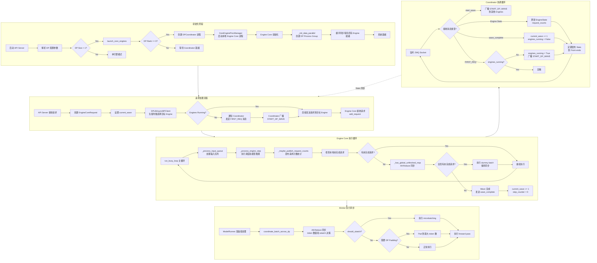

# vLLM Data Parallelism 实现分析

## 1. 核心代码位置

### 1.1 配置相关

| 文件路径 | 行号 | 功能说明 |
|---------|------|---------|
| `vllm/config/parallel.py` | 117-232 | ParallelConfig 中 DP 相关配置字段定义 |
| `vllm/config/parallel.py` | 486-489 | `world_size_across_dp` 属性计算 |
| `vllm/config/parallel.py` | 551-600 | `stateless_init_dp_group()` 初始化无状态 DP 进程组 |
| `vllm/config/parallel.py` | 656-664 | `has_unfinished_dp()` 检查 DP ranks 是否有未完成请求 |
| `vllm/engine/arg_utils.py` | 457-466, 947-999, 1721-1875 | DP 相关 CLI 参数定义 |

### 1.2 DP Coordinator (协调器)

| 文件路径 | 行号 | 功能说明 |
|---------|------|---------|
| `vllm/v1/engine/coordinator.py` | 23-144 | `DPCoordinator` 类 - DP 协调器主类 |
| `vllm/v1/engine/coordinator.py` | 146-150 | `EngineState` 类 - 引擎状态跟踪 |
| `vllm/v1/engine/coordinator.py` | 151-466 | `DPCoordinatorProc` 类 - 协调器进程实现 |

### 1.3 Engine Core Client (引擎客户端)

| 文件路径 | 行号 | 功能说明 |
|---------|------|---------|
| `vllm/v1/engine/core_client.py` | 1137-1315 | `DPAsyncMPClient` 类 - 外部负载均衡 DP 客户端 |
| `vllm/v1/engine/core_client.py` | 1317-1696 | `DPLBAsyncMPClient` 类 - 内部负载均衡 DP 客户端 |

### 1.4 Engine Core (引擎核心)

| 文件路径 | 行号 | 功能说明 |
|---------|------|---------|
| `vllm/v1/engine/core.py` | 1614-1785 | `DPEngineCoreProc` 类 - DP 引擎核心进程 |
| `vllm/v1/engine/core.py` | 1655-1668 | `_init_data_parallel()` DP 进程组初始化 |
| `vllm/v1/engine/core.py` | 1731-1785 | `run_busy_loop()` DP 引擎核心循环 |
| `vllm/v1/engine/core.py` | 1787-1793 | `_has_global_unfinished_reqs()` 全局未完成请求检查 |
| `vllm/v1/engine/core.py` | 2024-2045 | `DPMoEEngineCoreActor` - MoE DP Ray Actor |
| `vllm/v1/engine/core.py` | 2047-2076 | `EngineCoreActor` - 非 MoE DP Ray Actor |

### 1.5 Engine Utils (引擎工具)

| 文件路径 | 行号 | 功能说明 |
|---------|------|---------|
| `vllm/v1/engine/utils.py` | 98-231 | `CoreEngineProcManager` - 多进程引擎管理 |
| `vllm/v1/engine/utils.py` | 311-939 | `CoreEngineActorManager` - Ray Actor 引擎管理 |
| `vllm/v1/engine/utils.py` | 463-655 | `create_dp_placement_groups()` - Ray placement groups 创建 |
| `vllm/v1/engine/utils.py` | 979-1129 | `launch_core_engines()` - 启动引擎和 DP coordinator |

### 1.6 Distributed Process Group (分布式进程组)

| 文件路径 | 行号 | 功能说明 |
|---------|------|---------|
| `vllm/distributed/parallel_state.py` | 1245-1262 | DP process group 存储和获取 |
| `vllm/distributed/parallel_state.py` | 1561-1713 | DP/TP/PP/EP rank 布局和进程组初始化 |

### 1.7 Worker DP Utils (Worker DP 工具)

| 文件路径 | 行号 | 功能说明 |
|---------|------|---------|
| `vllm/v1/worker/dp_utils.py` | 36-52 | `_run_ar()` - 执行 all-reduce 操作 |
| `vllm/v1/worker/dp_utils.py` | 99-159 | `_synchronize_dp_ranks()` - DP ranks 同步 |
| `vllm/v1/worker/dp_utils.py` | 162-223 | `coordinate_batch_across_dp()` - 跨 DP 协调批处理 |
| `vllm/v1/worker/gpu/dp_utils.py` | 16-79 | `sync_cudagraph_and_dp_padding()` - CUDA graph 和 DP padding 同步 |

### 1.8 数据结构定义

| 文件路径 | 行号 | 功能说明 |
|---------|------|---------|
| `vllm/v1/engine/__init__.py` | 91-104 | `EngineCoreRequest` DP 相关字段 |
| `vllm/v1/engine/__init__.py` | 215-253 | `EngineCoreOutputs` DP 输出字段 |
| `vllm/v1/engine/__init__.py` | 238 | `EngineCoreRequestType.START_DP_WAVE` - 启动 wave 消息类型 |

---

## 2. Data Parallelism 执行流程图



---

## 3. 执行流程详解

### 3.1 初始化阶段

#### 3.1.1 配置解析

DP 配置通过 CLI 参数或配置文件传入，主要包括：

- `data_parallel_size`: DP 组数量（默认为 1）
- `data_parallel_size_local`: 本节点 DP 组数量
- `data_parallel_rank`: 当前进程在 DP 组中的 rank
- `data_parallel_backend`: 后端类型（`mp` 多进程或 `ray`）
- `data_parallel_external_lb`: 外部负载均衡模式
- `data_parallel_hybrid_lb`: 混合负载均衡模式

#### 3.1.2 Coordinator 创建

当 `DP Size > 1` 且 `DP Rank == 0` 时，创建 `DPCoordinator` 进程：

1. Coordinator 作为中间协调者，位于多个 DP Engine 进程和前端 API Server 进程之间
2. 使用 ZMQ XPUB/PULL socket 进行通信
3. 收集各 Engine 的负载统计并发布给前端用于负载均衡决策
4. 管理 "request wave" 状态协调

#### 3.1.3 Engine Core 进程启动

`CoreEngineProcManager` 负责启动本地 Engine Core 进程：

1. 根据 `data_parallel_size_local` 确定本地启动的进程数
2. 每个进程设置对应的 `CUDA_VISIBLE_DEVICES`
3. 通过 ZMQ ROUTER socket 进行握手同步

#### 3.1.4 DP Process Group 初始化

每个 Engine Core 进程调用 `_init_data_parallel()`：

1. 使用 Gloo/NCCL 创建 stateless process group
2. 用于后续的 all-reduce 同步操作
3. 存储到 `parallel_state._DP` 全局变量

### 3.2 请求处理流程

#### 3.2.1 请求接收

API Server 接收到请求后：

1. 创建 `EngineCoreRequest` 对象
2. 设置 `current_wave` 字段（当前 wave 号）
3. 设置 `client_index` 用于响应路由

#### 3.2.2 负载均衡

`DPLBAsyncMPClient.get_core_engine_for_request()` 执行负载均衡：

1. 获取各 Engine 的 `[waiting, running]` 请求计数
2. 计算负载评分：`score = waiting * 4 + running`
3. 选择评分最低的 Engine
4. 更新本地 waiting 计数以优化下次选择
5. 记录请求到 Engine 的映射用于 abort 路由

#### 3.2.3 Wave 协调

当 Engines 处于 paused 状态时收到新请求：

1. Client 发送 `FIRST_REQ` 消息通知 Coordinator
2. Coordinator 广播 `START_DP_WAVE` 到所有 Engines
3. Engines 收到消息后设置 `engines_running = True` 进入运行状态

### 3.3 Engine Core 执行循环

#### 3.3.1 主循环 (`run_busy_loop`)

```python
while self._handle_shutdown():
    self._process_input_queue()       # 处理输入队列
    executed = self._process_engine_step()  # 执行调度和推理
    self._maybe_publish_request_counts()    # 发布统计
    self.engines_running = self._has_global_unfinished_reqs(...)
```

#### 3.3.2 全局未完成请求检查

`_has_global_unfinished_reqs()` 每 32 步执行一次 all-reduce：

```python
self.step_counter += 1
if self.step_counter % 32 != 0:
    return True  # 优化：减少同步频率
return ParallelConfig.has_unfinished_dp(self.dp_group, local_unfinished)
```

这个 all-reduce 操作确保所有 DP ranks 状态一致：
- 如果任何 rank 有未完成请求，所有 ranks 继续运行
- 如果所有 ranks 都无未完成请求，进入 paused 状态

#### 3.3.3 Dummy Batch 执行

当本地 Engine 无请求但全局有未完成请求时：

```python
if not executed:
    if not local_unfinished_reqs and not self.engines_running:
        continue  # 所有引擎空闲
    # 运行状态但无本地请求，执行 dummy batch
    self.execute_dummy_batch()
```

Dummy batch 确保：
- CUDA graph 重放一致性
- MoE 专家并行同步
- 避免 GPU 资源空闲浪费

### 3.4 Coordinator 协调循环

#### 3.4.1 Stats 收集

Coordinator 从各 Engine 收集 `SchedulerStats`：

```python
stats[0] = scheduler_stats.num_waiting_reqs
stats[1] = scheduler_stats.num_running_reqs
```

定期发布到前端用于负载均衡决策（默认 100ms 间隔）。

#### 3.4.2 Wave 状态管理

Wave 是 DP 同步的核心概念：

- **Wave Number**: 计数器，每次 Engines 从 running 到 paused 状态转换时 +1
- **Running State**: Engines 正在处理请求
- **Paused State**: 所有 Engines 空闲等待新请求

状态转换触发：
- `wave_complete`: DP Rank 0 通知 Coordinator 所有请求完成
- `START_DP_WAVE`: Coordinator 通知 Engines 开始新 wave

### 3.5 Worker 执行同步

#### 3.5.1 批处理协调

`coordinate_batch_across_dp()` 在 forward pass 前执行：

```python
tensor = _run_ar(
    should_ubatch=should_attempt_ubatching,
    orig_num_tokens_per_ubatch=num_tokens_unpadded,
    padded_num_tokens_per_ubatch=num_tokens_padded,
    cudagraph_mode=cudagraph_mode,
    parallel_config=parallel_config,
)
```

All-Reduce 同步内容：
1. 每个 rank 的原始 token 数
2. 每个 rank 的 padded token 数
3. 是否计划执行 microbatching
4. CUDA graph 模式

#### 3.5.2 DP Padding 决策

```python
should_dp_pad = synced_cudagraph_mode != 0 or should_ubatch
if should_dp_pad:
    max_num_tokens = int(num_tokens_across_dp.max().item())
    # 所有 ranks pad 到最大 token 数
```

DP Padding 确保：
- CUDA graph 重放时 batch size 一致
- Microbatching 时各 rank 执行相同数量的 microbatches

---

## 4. 关键数据结构

### 4.1 EngineCoreRequest

```python
@dataclass
class EngineCoreRequest:
    request_id: str
    data_parallel_rank: int | None  # 目标 DP rank（可选）
    current_wave: int = 0           # 请求 wave 号
    client_index: int = 0           # 客户端索引
```

### 4.2 EngineCoreOutputs

```python
@dataclass
class EngineCoreOutputs:
    wave_complete: int | None       # Wave 完成通知
    start_wave: int | None          # 启动新 wave 通知
    scheduler_stats: SchedulerStats | None  # 负载统计
    engine_index: int               # Engine 索引
```

### 4.3 SchedulerStats

```python
@dataclass
class SchedulerStats:
    num_waiting_reqs: int           # 等待队列长度
    num_running_reqs: int           # 运行队列长度
    step_counter: int               # 步数计数器
    current_wave: int               # 当前 wave 号
```

---

## 5. 通信机制

### 5.1 ZMQ Socket 类型

| Socket | 类型 | 用途 |
|--------|------|------|
| `publish_front` | XPUB | Coordinator 发布 stats 到前端 |
| `output_back` | PULL | Coordinator 接收 Engine 输出 |
| `publish_back` | XPUB | Coordinator 广播 START_DP_WAVE 到 Engines |
| `input_socket` | ROUTER | Engine 接收请求 |
| `output_socket` | PUSH | Engine 发送输出 |

### 5.2 All-Reduce 同步

使用 stateless process group (Gloo/NCCL)：

```python
# 配置
dist.all_reduce(tensor, group=group)

# 应用场景
1. Worker 批处理协调（每步）
2. Engine 全局未完成请求检查（每 32 步）
```

---

## 6. 负载均衡模式

### 6.1 Internal LB (内部负载均衡)

- 默认模式
- `DPLBAsyncMPClient` 在客户端执行负载均衡
- 基于 Coordinator 发布的 stats 选择目标 Engine

### 6.2 External LB (外部负载均衡)

- `data_parallel_external_lb=True`
- 外部系统负责负载均衡
- Client 直接发送请求到指定 DP rank
- Coordinator 不发布 stats，仅处理 wave 协调

### 6.3 Hybrid LB (混合负载均衡)

- `data_parallel_hybrid_lb=True`
- API Server 与 Engine Core 共置
- 本地 Engine 优先，跨节点时使用 Coordinator

---

## 7. 与 TP/PP/EP 的关系

### 7.1 Rank 布局

```python
all_ranks = torch.arange(world_size).reshape(
    -1,
    data_parallel_size,        # DP 维度
    pipeline_parallel_size,    # PP 维度
    prefill_context_parallel_size,
    tensor_model_parallel_size,  # TP 维度
)
```

### 7.2 进程组关系

- **DP Group**: 每个 DP rank 包含一个完整的 TP+PP 组
- **TP Group**: 同一 DP rank 内的 GPU workers
- **PP Group**: 同一 DP rank 内的 pipeline stages
- **EP Group**: MoE 专家并行，跨 DP ranks 组成

### 7.3 通信层次

```
API Server (DP Rank 0)
    │
    ├── ZMQ → DPCoordinator
    │           │
    │           ├── ZMQ → Engine Core (DP Rank 0) [TP=2, PP=1]
    │           │           │
    │           │           ├── GPU Worker 0 (TP Rank 0)
    │           │           └── GPU Worker 1 (TP Rank 1)
    │           │
    │           ├── ZMQ → Engine Core (DP Rank 1) [TP=2, PP=1]
    │           │           │
    │           │           ├── GPU Worker 2 (TP Rank 0)
    │           │           └── GPU Worker 3 (TP Rank 1)
    │           │
    │           └── ...
    │
    └── All-Reduce (Gloo/NCCL) ←→ DP Group Synchronization
```

---

## 8. 总结

vLLM 的 Data Parallelism 实现具有以下特点：

1. **进程架构**: 多进程设计，API Server、Coordinator、Engine Core 分离
2. **通信机制**: ZMQ 用于进程间通信，NCCL/Gloo 用于 GPU 同步
3. **Wave 协调**: 基于 wave number 的全局状态同步机制
4. **负载均衡**: 支持内部、外部、混合三种负载均衡模式
5. **CUDA Graph 兼容**: DP Padding 确保 CUDA graph 重放一致性
6. **MoE 支持**: 针对 MoE 模型的特殊 wave 协调逻辑
7. **Elastic EP**: 支持动态扩展 DP size（Ray backend）