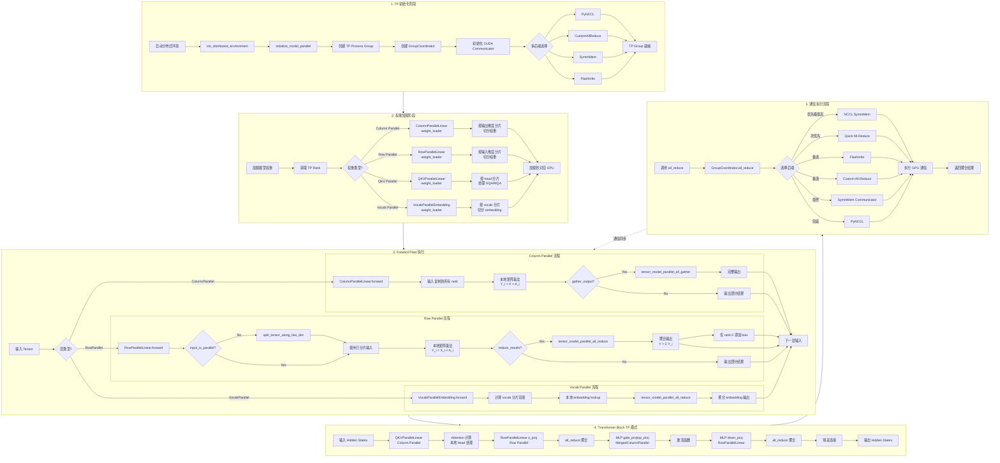

# vLLM Tensor Parallelism 实现分析

## 1. 核心代码位置

### 1.1 配置相关

| 文件路径 | 行号 | 功能说明 |
|---------|------|---------|
| `vllm/config/parallel.py` | 114 | `tensor_parallel_size` - TP size 配置字段 |
| `vllm/config/parallel.py` | 108-484 | `ParallelConfig` 类 - 并行配置主类 |
| `vllm/config/parallel.py` | 725-729 | `world_size` 计算 (TP × PP × PCP) |
| `vllm/config/parallel.py` | 486-489 | `world_size_across_dp` - 包含 DP 的 world size |

### 1.2 进程组初始化与管理

| 文件路径 | 行号 | 功能说明 |
|---------|------|---------|
| `vllm/distributed/parallel_state.py` | 1218 | `_TP` - TP group coordinator 全局变量 |
| `vllm/distributed/parallel_state.py` | 1221-1223 | `get_tp_group()` - 获取 TP group |
| `vllm/distributed/parallel_state.py` | 1829-1831 | `get_tensor_model_parallel_world_size()` |
| `vllm/distributed/parallel_state.py` | 1834-1836 | `get_tensor_model_parallel_rank()` |
| `vllm/distributed/parallel_state.py` | 1486-1727 | `initialize_model_parallel()` - 主初始化函数 |
| `vllm/distributed/parallel_state.py` | 1730-1773 | `ensure_model_parallel_initialized()` |
| `vllm/distributed/parallel_state.py` | 1855-1891 | `destroy_model_parallel()` |
| `vllm/distributed/parallel_state.py` | 1569-1584 | TP group 创建逻辑 |
| `vllm/distributed/parallel_state.py` | 1151-1166 | `init_model_parallel_group()` |
| `vllm/distributed/parallel_state.py` | 290-1122 | `GroupCoordinator` 类 - 核心通信协调器 |

### 1.3 通信原语 (All-Reduce, All-Gather, Reduce-Scatter)

| 文件路径 | 行号 | 功能说明 |
|---------|------|---------|
| `vllm/distributed/communication_op.py` | 12-14 | `tensor_model_parallel_all_reduce()` |
| `vllm/distributed/communication_op.py` | 17-21 | `tensor_model_parallel_all_gather()` |
| `vllm/distributed/communication_op.py` | 24-28 | `tensor_model_parallel_reduce_scatter()` |
| `vllm/distributed/communication_op.py` | 31-35 | `tensor_model_parallel_gather()` |
| `vllm/distributed/communication_op.py` | 38-43 | `broadcast_tensor_dict()` |
| `vllm/distributed/parallel_state.py` | 130-136 | `all_reduce` custom op 注册 |
| `vllm/distributed/parallel_state.py` | 142-149 | `reduce_scatter` custom op 注册 |
| `vllm/distributed/parallel_state.py` | 160-167 | `all_gather` custom op 注册 |
| `vllm/distributed/parallel_state.py` | 262-278 | Custom ops 实现 |

### 1.4 设备通信器 (CUDA 实现)

| 文件路径 | 行号 | 功能说明 |
|---------|------|---------|
| `vllm/distributed/device_communicators/base_device_communicator.py` | 118-374 | `DeviceCommunicatorBase` - 通信基类 |
| `vllm/distributed/device_communicators/base_device_communicator.py` | 180-182 | `all_reduce()` 默认实现 |
| `vllm/distributed/device_communicators/base_device_communicator.py` | 184-207 | `all_gather()` 实现 |
| `vllm/distributed/device_communicators/base_device_communicator.py` | 217-248 | `reduce_scatter()` 实现 |
| `vllm/distributed/device_communicators/cuda_communicator.py` | 25-173 | `CudaCommunicator.__init__` - 多后端初始化 |
| `vllm/distributed/device_communicators/cuda_communicator.py` | 174-231 | `all_reduce()` - 多路径优先级 |
| `vllm/distributed/device_communicators/cuda_communicator.py` | 233-256 | `reduce_scatter()` |
| `vllm/distributed/device_communicators/cuda_communicator.py` | 258-291 | `reduce_scatterv()` |
| `vllm/distributed/device_communicators/cuda_communicator.py` | 346-392 | `all_gatherv()` |

### 1.5 NCCL 后端

| 文件路径 | 行号 | 功能说明 |
|---------|------|---------|
| `vllm/distributed/device_communicators/pynccl.py` | 58-145 | `PyNcclCommunicator.__init__` |
| `vllm/distributed/device_communicators/pynccl.py` | 153-184 | `all_reduce()` NCCL 实现 |
| `vllm/distributed/device_communicators/pynccl.py` | 186-207 | `all_gather()` NCCL 实现 |
| `vllm/distributed/device_communicators/pynccl.py` | 209-242 | `all_gatherv()` NCCL 实现 |
| `vllm/distributed/device_communicators/pynccl.py` | 244-270 | `reduce_scatter()` NCCL 实现 |
| `vllm/distributed/device_communicators/pynccl.py` | 272-307 | `reduce_scatterv()` NCCL 实现 |

### 1.6 自定义 All-Reduce 实现

| 文件路径 | 行号 | 功能说明 |
|---------|------|---------|
| `vllm/distributed/device_communicators/custom_all_reduce.py` | 54-196 | `CustomAllreduce.__init__` |
| `vllm/distributed/device_communicators/custom_all_reduce.py` | 232-245 | `should_custom_ar()` - 条件判断 |
| `vllm/distributed/device_communicators/custom_all_reduce.py` | 266-282 | `custom_all_reduce()` - 主 API |
| `vllm/distributed/device_communicators/symm_mem.py` | 32-114 | `SymmMemCommunicator` |
| `vllm/distributed/device_communicators/symm_mem.py` | 126-155 | Symmetric Memory all-reduce |
| `vllm/distributed/device_communicators/quick_all_reduce.py` | - | Quick All-Reduce 实现 |
| `vllm/distributed/device_communicators/flashinfer_all_reduce.py` | - | FlashInfer All-Reduce |

### 1.7 Linear 层分片

| 文件路径 | 行号 | 功能说明 |
|---------|------|---------|
| `vllm/model_executor/layers/linear.py` | 408-607 | `ColumnParallelLinear` - 列并行线性层 |
| `vllm/model_executor/layers/linear.py` | 450-455 | 输出维度分片计算 |
| `vllm/model_executor/layers/linear.py` | 534-569 | `weight_loader()` |
| `vllm/model_executor/layers/linear.py` | 579-598 | `forward()` - 可选 all-gather |
| `vllm/model_executor/layers/linear.py` | 1387-1573 | `RowParallelLinear` - 行并行线性层 |
| `vllm/model_executor/layers/linear.py` | 1439-1444 | 输入维度分片计算 |
| `vllm/model_executor/layers/linear.py` | 1494-1527 | `weight_loader()` |
| `vllm/model_executor/layers/linear.py` | 1538-1565 | `forward()` - all-reduce |
| `vllm/model_executor/layers/linear.py` | 609-974 | `MergedColumnParallelLinear` |
| `vllm/model_executor/layers/linear.py` | 977-1384 | `QKVParallelLinear` |
| `vllm/model_executor/layers/linear.py` | 1028-1047 | GQA/MQA head 分片逻辑 |
| `vllm/model_executor/layers/linear.py` | 288-406 | `ReplicatedLinear` - 非分片线性层 |

### 1.8 Vocab Parallel Embedding

| 文件路径 | 行号 | 功能说明 |
|---------|------|---------|
| `vllm/model_executor/layers/vocab_parallel_embedding.py` | 190-499 | `VocabParallelEmbedding` |
| `vllm/model_executor/layers/vocab_parallel_embedding.py` | 320-356 | `_get_indices()` - shard 索引计算 |
| `vllm/model_executor/layers/vocab_parallel_embedding.py` | 423-468 | `weight_loader()` |
| `vllm/model_executor/layers/vocab_parallel_embedding.py` | 470-490 | `forward()` - all-reduce |
| `vllm/model_executor/layers/vocab_parallel_embedding.py` | 501-568 | `ParallelLMHead` |

### 1.9 Attention 层 TP 实现

| 文件路径 | 行号 | 功能说明 |
|---------|------|---------|
| `vllm/model_executor/layers/attention/attention.py` | 177-803 | `Attention` 类 |
| `vllm/model_executor/models/llama.py` | 124-251 | `LlamaAttention` - TP-aware 实现 |
| `vllm/model_executor/models/llama.py` | 142-155 | Head partitioning |
| `vllm/model_executor/models/llama.py` | 164-172 | QKVParallelLinear 使用 |
| `vllm/model_executor/models/llama.py` | 174-180 | RowParallelLinear (o_proj) |

### 1.10 MoE TP 实现

| 文件路径 | 行号 | 功能说明 |
|---------|------|---------|
| `vllm/model_executor/layers/fused_moe/runner/moe_runner.py` | 180-400 | `MoERunner` 类 |
| `vllm/model_executor/layers/fused_moe/runner/moe_runner.py` | 337-355 | `_maybe_reduce_shared_expert_output()` |
| `vllm/model_executor/layers/fused_moe/runner/moe_runner.py` | 357-379 | `_maybe_reduce_final_output()` |
| `vllm/model_executor/models/qwen3_moe.py` | 137-200 | `Qwen3MoeSparseMoBlock` |

### 1.11 工具函数

| 文件路径 | 行号 | 功能说明 |
|---------|------|---------|
| `vllm/distributed/utils.py` | 60-64 | `divide()` - 除法并检查可除性 |
| `vllm/distributed/utils.py` | 67-92 | `split_tensor_along_last_dim()` |
| `vllm/distributed/utils.py` | 95-140 | `get_pp_indices()` |

### 1.12 权重加载

| 文件路径 | 行号 | 功能说明 |
|---------|------|---------|
| `vllm/model_executor/parameter.py` | 31-127 | `BasevLLMParameter` |
| `vllm/model_executor/parameter.py` | 129-202 | `_ColumnvLLMParameter` |
| `vllm/model_executor/parameter.py` | 148-154 | `load_column_parallel_weight()` |
| `vllm/model_executor/parameter.py` | 204-231 | `RowvLLMParameter` |

---

## 2. Tensor Parallelism 执行流程图



---

## 3. 详细流程说明

### 3.1 TP 初始化阶段

#### 3.1.1 分布式环境初始化

**文件**: `vllm/distributed/parallel_state.py`

```python
def initialize_model_parallel(
    tensor_model_parallel_size: int = 1,
    pipeline_model_parallel_size: int = 1,
    ...
) -> None:
    """
    初始化所有并行组 (TP, PP, DP, EP 等)
    
    Rank 布局:
    all_ranks = [0, 1, 2, ..., world_size-1]
    
    按 (DP, PP, PCP, TP) 顺序 reshape:
    all_ranks.reshape(
        -1,
        data_parallel_size,
        pipeline_parallel_size,
        prefill_context_parallel_size,
        tensor_model_parallel_size
    )
    """
    
    # 1. 计算 rank 分组 (Line 1561-1567)
    all_ranks = torch.arange(world_size).reshape(
        -1, data_parallel_size, pipeline_parallel_size, 
        prefill_context_parallel_size, tensor_model_parallel_size
    )
    
    # 2. 创建 TP groups (Line 1569-1584)
    for dp_idx in range(data_parallel_size):
        for pp_idx in range(pipeline_parallel_size):
            for pcp_idx in range(prefill_context_parallel_size):
                ranks = all_ranks[dp_idx, pp_idx, pcp_idx, :]
                group = init_model_parallel_group(ranks, "tp")
                
    # 3. 设置全局 _TP coordinator (Line 1584)
    _TP = GroupCoordinator(
        ranks, 
        local_rank=local_rank,
        group_name="tp",
        ...
    )
```

#### 3.1.2 GroupCoordinator 初始化

**文件**: `vllm/distributed/parallel_state.py` (Line 290-402)

```python
class GroupCoordinator:
    def __init__(self, ranks, local_rank, group_name, ...):
        # 1. 创建 CPU process group (用于元数据通信)
        self.cpu_group = init_process_group(
            backend="gloo",
            init_method=...,
            ranks=ranks,
        )
        
        # 2. 创建 Device process group (用于 GPU 通信)
        self.device_group = init_process_group(
            backend="nccl",
            init_method=...,
            ranks=ranks,
        )
        
        # 3. 初始化 CUDA Communicator (多后端)
        self.device_communicator = CudaCommunicator(
            group=self.device_group,
            ...
        )
```

#### 3.1.3 CUDA Communicator 后端选择

**文件**: `vllm/distributed/device_communicators/cuda_communicator.py` (Line 26-173)

```python
class CudaCommunicator:
    def __init__(self, group, ...):
        # 初始化多个 all-reduce 后端
        
        # 1. PyNCCL (NCCL 官方)
        self.pynccl = PyNcclCommunicator(group, ...)
        
        # 2. Custom All-Reduce (自研低延迟)
        if should_use_custom_ar():
            self.custom_ar = CustomAllreduce(group, ...)
        
        # 3. Symmetric Memory (PyTorch 原生)
        if should_use_symm_mem():
            self.symm_mem = SymmMemCommunicator(group, ...)
        
        # 4. FlashInfer All-Reduce
        if should_use_flashinfer():
            self.flashinfer_ar = FlashInferAllReduce(group, ...)
        
        # 5. Quick All-Reduce (优化版)
        self.quick_ar = QuickAllReduce(group, ...)
```

---

### 3.2 权重加载阶段

#### 3.2.1 Column Parallel 权重分片

**文件**: `vllm/model_executor/layers/linear.py` (Line 450-505)

```python
class ColumnParallelLinear(LinearBase):
    def __init__(self, input_size, output_size, ...):
        # 1. 获取 TP rank 和 size
        self.tp_rank = get_tensor_model_parallel_rank()
        self.tp_size = get_tensor_model_parallel_world_size()
        
        # 2. 计算分片大小
        self.output_size_per_partition = divide(output_size, self.tp_size)
        
        # 3. 创建本地权重
        # 权重形状: [input_size, output_size_per_partition]
        self.weight = Parameter(
            torch.empty(input_size, self.output_size_per_partition)
        )
        
        # 4. 设置权重加载属性
        set_weight_attrs(self.weight, {
            "output_dim": 1,  # 沿输出维度分片
            "weight_loader": self.weight_loader,
        })
        
        # 5. Bias 也分片
        self.bias = Parameter(
            torch.empty(self.output_size_per_partition)
        )
```

#### 3.2.2 Row Parallel 权重分片

**文件**: `vllm/model_executor/layers/linear.py` (Line 1439-1485)

```python
class RowParallelLinear(LinearBase):
    def __init__(self, input_size, output_size, ...):
        # 1. 获取 TP 信息
        self.tp_rank = get_tensor_model_parallel_rank()
        self.tp_size = get_tensor_model_parallel_world_size()
        
        # 2. 输入维度分片
        self.input_size_per_partition = divide(input_size, self.tp_size)
        
        # 3. 创建权重
        # 权重形状: [input_size_per_partition, output_size]
        self.weight = Parameter(
            torch.empty(self.input_size_per_partition, output_size)
        )
        
        # 4. 设置权重加载属性
        set_weight_attrs(self.weight, {
            "input_dim": 0,  # 沿输入维度分片
            "weight_loader": self.weight_loader,
        })
        
        # 5. Bias 不分片 (仅 rank 0 添加)
        self.bias = Parameter(torch.empty(output_size))
```

#### 3.2.3 权重加载器

**文件**: `vllm/model_executor/layers/linear.py`

```python
# Column Parallel weight_loader (Line 534-569)
def weight_loader(self, param: Parameter, loaded_weight: torch.Tensor):
    # 计算当前 rank 对应的权重切片
    output_size_per_partition = param.shape[0]
    start_idx = self.tp_rank * output_size_per_partition
    end_idx = start_idx + output_size_per_partition
    
    # 加载对应分片
    loaded_weight = loaded_weight[start_idx:end_idx]
    param.data.copy_(loaded_weight)

# Row Parallel weight_loader (Line 1494-1527)
def weight_loader(self, param: Parameter, loaded_weight: torch.Tensor):
    # 计算输入维度切片
    input_size_per_partition = param.shape[0]
    start_idx = self.tp_rank * input_size_per_partition
    end_idx = start_idx + input_size_per_partition
    
    # 加载对应分片
    loaded_weight = loaded_weight[start_idx:end_idx]
    param.data.copy_(loaded_weight)
```

---

### 3.3 Forward Pass 执行

#### 3.3.1 ColumnParallelLinear Forward

**文件**: `vllm/model_executor/layers/linear.py` (Line 579-598)

```python
def forward(self, input_: torch.Tensor) -> tuple[torch.Tensor, torch.Tensor]:
    """
    Column Parallel Forward
    
    输入: X (完整输入，复制到所有 rank)
    权重: A_i (每个 rank 拥有不同的列分片)
    计算: Y_i = X × A_i (部分输出)
    
    如果 gather_output=True: Y = all_gather([Y_1, ..., Y_p])
    """
    
    # 1. 本地矩阵乘法
    bias = self.bias if not self.skip_bias_add else None
    output_parallel = self.quant_method.apply(self, input_, bias)
    
    # 2. 可选 all-gather
    if self.gather_output and self.tp_size > 1:
        # 沿输出维度 gather
        output = tensor_model_parallel_all_gather(output_parallel)
    else:
        output = output_parallel
    
    return output, output_bias
```

#### 3.3.2 RowParallelLinear Forward

**文件**: `vllm/model_executor/layers/linear.py` (Line 1538-1565)

```python
def forward(self, input_: torch.Tensor) -> tuple[torch.Tensor, torch.Tensor]:
    """
    Row Parallel Forward
    
    输入: X (分片输入，每个 rank 拥有不同的行分片)
    权重: A_i (每个 rank 拥有不同的行分片)
    计算: Y_i = X_i × A_i (部分输出)
    
    如果 reduce_results=True: Y = all_reduce([Y_1, ..., Y_p]) = Σ Y_i
    """
    
    # 1. 输入分片处理
    if self.input_is_parallel:
        input_parallel = input_
    else:
        # 沿最后维度分片
        split_input = split_tensor_along_last_dim(input_, self.tp_size)
        input_parallel = split_input[self.tp_rank].contiguous()
    
    # 2. 本地矩阵乘法
    # 只有 rank 0 添加 bias (避免重复添加)
    bias_ = None if (self.tp_rank > 0 or self.skip_bias_add) else self.bias
    output_parallel = self.quant_method.apply(self, input_parallel, bias_)
    
    # 3. all-reduce 聚合
    if self.reduce_results and self.tp_size > 1:
        output = tensor_model_parallel_all_reduce(output_parallel)
    else:
        output = output_parallel
    
    return output, output_bias
```

#### 3.3.3 QKVParallelLinear (GQA/MQA 支持)

**文件**: `vllm/model_executor/layers/linear.py` (Line 1028-1047)

```python
class QKVParallelLinear(ColumnParallelLinear):
    """
    QKV 投影的 TP 实现
    
    处理 GQA (Grouped Query Attention) 和 MQA (Multi-Query Attention):
    - Query heads 正常分片
    - Key/Value heads 可能复制 (当 kv_heads < tp_size)
    """
    
    def __init__(self, ...):
        # Query heads 分片
        self.num_heads = divide(total_num_heads, tp_size)
        
        # Key/Value heads 处理
        if tp_size >= total_num_kv_heads:
            # KV heads 复制到多个 rank
            self.num_kv_heads = 1
            self.num_kv_head_replicas = divide(tp_size, total_num_kv_heads)
        else:
            # KV heads 分片
            self.num_kv_heads = divide(total_num_kv_heads, tp_size)
            self.num_kv_head_replicas = 1
        
        # 输出大小
        self.output_sizes = [
            self.num_heads * self.head_size * tp_size,      # Q
            self.num_kv_heads * self.head_size * tp_size,   # K
            self.num_kv_heads * self.v_head_size * tp_size, # V
        ]
```

---

### 3.4 Transformer Block TP 模式

#### 3.4.1 标准 Transformer TP 布局

```
                    TP Rank 0          TP Rank 1          TP Rank 2          TP Rank 3
                    
输入 Hidden States: [完整复制]         [完整复制]         [完整复制]         [完整复制]
                    
                    ┌──────────────┐   ┌──────────────┐   ┌──────────────┐   ┌──────────────┐
                    │   QKV Proj   │   │   QKV Proj   │   │   QKV Proj   │   │   QKV Proj   │
                    │ (Column Par) │   │ (Column Par) │   │ (Column Par) │   │ (Column Par) │
                    │  heads: 0-7  │   │  heads: 8-15 │   │ heads:16-23 │   │ heads:24-31 │
                    └──────────────┘   └──────────────┘   └──────────────┘   └──────────────┘
                           │                 │                 │                 │
                           ▼                 ▼                 ▼                 ▼
                    [部分 QKV]        [部分 QKV]        [部分 QKV]        [部分 QKV]
                           │                 │                 │                 │
                    ┌──────────────┐   ┌──────────────┐   ┌──────────────┐   ┌──────────────┐
                    │  Attention   │   │  Attention   │   │  Attention   │   │  Attention   │
                    │ (本地计算)    │   │ (本地计算)    │   │ (本地计算)    │   │ (本地计算)    │
                    └──────────────┘   └──────────────┘   └──────────────┘   └──────────────┘
                           │                 │                 │                 │
                           ▼                 ▼                 ▼                 ▼
                    [部分 attn out]   [部分 attn out]   [部分 attn out]   [部分 attn out]
                           │                 │                 │                 │
                    ┌──────────────┐   ┌──────────────┐   ┌──────────────┐   ┌──────────────┐
                    │   O_proj     │   │   O_proj     │   │   O_proj     │   │   O_proj     │
                    │ (Row Par)    │   │ (Row Par)    │   │ (Row Par)    │   │ (Row Par)    │
                    └──────────────┘   └──────────────┘   └──────────────┘   └──────────────┘
                           │                 │                 │                 │
                           └───all_reduce────┴─────────────────┴─────────────────┘
                                                │
                                                ▼
                    [完整 Attention Output] (所有 rank 相同)
```

#### 3.4.2 MLP TP 布局

```
                    TP Rank 0          TP Rank 1          TP Rank 2          TP Rank 3
                    
                    ┌──────────────┐   ┌──────────────┐   ┌──────────────┐   ┌──────────────┐
                    │gate_up_proj  │   │gate_up_proj  │   │gate_up_proj  │   │gate_up_proj  │
                    │(MergedCol)   │   │(MergedCol)   │   │(MergedCol)   │   │(MergedCol)   │
                    └──────────────┘   └──────────────┘   └──────────────┘   └──────────────┘
                           │                 │                 │                 │
                           ▼                 ▼                 ▼                 ▼
                    [部分 gate+up]    [部分 gate+up]    [部分 gate+up]    [部分 gate+up]
                           │                 │                 │                 │
                    ┌──────────────┐   ┌──────────────┐   ┌──────────────┐   ┌──────────────┐
                    │   Silu+Mul   │   │   Silu+Mul   │   │   Silu+Mul   │   │   Silu+Mul   │
                    └──────────────┘   └──────────────┘   └──────────────┘   └──────────────┘
                           │                 │                 │                 │
                           ▼                 ▼                 ▼                 ▼
                    [部分激活结果]    [部分激活结果]    [部分激活结果]    [部分激活结果]
                           │                 │                 │                 │
                    ┌──────────────┐   ┌──────────────┐   ┌──────────────┐   ┌──────────────┐
                    │  down_proj   │   │  down_proj   │   │  down_proj   │   │  down_proj   │
                    │ (Row Par)    │   │ (Row Par)    │   │ (Row Par)    │   │ (Row Par)    │
                    └──────────────┘   └──────────────┘   └──────────────┘   └──────────────┘
                           │                 │                 │                 │
                           └───all_reduce────┴─────────────────┴─────────────────┘
                                                │
                                                ▼
                    [完整 MLP Output] (所有 rank 相同)
```

---

### 3.5 通信执行流程

#### 3.5.1 All-Reduce 多后端优先级

**文件**: `vllm/distributed/device_communicators/cuda_communicator.py` (Line 174-231)

```python
def all_reduce(self, tensor: torch.Tensor) -> torch.Tensor:
    """
    All-Reduce 执行链 (优先级从高到低)
    """
    
    # 1. NCCL Symmetric Memory (最低延迟)
    if self.should_nccl_symm_mem_allreduce(tensor):
        return self.nccl_symm_mem.all_reduce(tensor)
    
    # 2. Quick All-Reduce (小 tensor 优化)
    if self.quick_ar.should_quick_ar(tensor):
        return self.quick_ar.all_reduce(tensor)
    
    # 3. FlashInfer All-Reduce
    if self.flashinfer_ar and self.flashinfer_ar.should_flashinfer_ar(tensor):
        return self.flashinfer_ar.all_reduce(tensor)
    
    # 4. Custom All-Reduce (P2P 共享内存)
    if self.custom_ar and self.custom_ar.should_custom_ar(tensor):
        return self.custom_ar.custom_all_reduce(tensor)
    
    # 5. Symmetric Memory Communicator
    if self.symm_mem and self.symm_mem.should_use_symm_mem(tensor):
        return self.symm_mem.all_reduce(tensor)
    
    # 6. PyNCCL (NCCL 官方)
    return self.pynccl.all_reduce(tensor)
```

#### 3.5.2 All-Gather 实现

**文件**: `vllm/distributed/communication_op.py` (Line 17-21)

```python
def tensor_model_parallel_all_gather(input_: torch.Tensor, dim: int = -1) -> torch.Tensor:
    """
    沿指定维度 gather tensor
    
    输入: [batch, size_per_partition] (每个 rank)
    输出: [batch, size_per_partition * tp_size] (所有 rank)
    """
    return get_tp_group().all_gather(input_, dim)
```

#### 3.5.3 通信操作底层实现

**文件**: `vllm/distributed/device_communicators/pynccl.py`

```python
class PyNcclCommunicator:
    def all_reduce(self, tensor: torch.Tensor, op: str = "sum") -> torch.Tensor:
        """NCCL all-reduce 实现"""
        # 调用 NCCL C API
        nccl.llNCCLAllReduce(
            sendbuff=tensor.data_ptr(),
            recvbuff=tensor.data_ptr(),
            count=tensor.numel(),
            datatype=get_nccl_dtype(tensor.dtype),
            op=get_nccl_reduce_op(op),
            comm=self.comm,
            stream=torch.cuda.current_stream(),
        )
        return tensor
    
    def all_gather(self, tensor: torch.Tensor, dim: int) -> torch.Tensor:
        """NCCL all-gather 实现"""
        output_shape = list(tensor.shape)
        output_shape[dim] = tensor.shape[dim] * self.world_size
        output = torch.empty(output_shape, dtype=tensor.dtype, device=tensor.device)
        
        nccl.llNCCLAllGather(
            sendbuff=tensor.data_ptr(),
            recvbuff=output.data_ptr(),
            count=tensor.numel(),
            datatype=get_nccl_dtype(tensor.dtype),
            comm=self.comm,
            stream=torch.cuda.current_stream(),
        )
        return output
```

---

## 4. 关键数据结构

### 4.1 GroupCoordinator

```python
# vllm/distributed/parallel_state.py
class GroupCoordinator:
    # 属性
    ranks: list[int]              # 组内 rank 列表
    local_rank: int               # 本地 rank
    world_size: int               # 组大小
    cpu_group: ProcessGroup       # CPU 通信组 (元数据)
    device_group: ProcessGroup    # GPU 通信组 (数据)
    device_communicator: CudaCommunicator  # CUDA 通信器
    
    # 方法
    all_reduce(tensor) -> Tensor
    all_gather(tensor, dim) -> Tensor
    reduce_scatter(tensor, dim) -> Tensor
    broadcast(tensor_dict) -> dict
```

### 4.2 Linear 层参数

```python
# ColumnParallelLinear
class ColumnParallelLinear:
    tp_rank: int                           # TP rank
    tp_size: int                           # TP world size
    input_size: int                        # 输入维度 (不分片)
    output_size: int                       # 输出维度 (总分片)
    output_size_per_partition: int         # 本 rank 分片大小
    gather_output: bool                    # 是否 gather 输出
    
# RowParallelLinear
class RowParallelLinear:
    tp_rank: int
    tp_size: int
    input_size: int                        # 输入维度 (总分片)
    input_size_per_partition: int          # 本 rank 分片大小
    output_size: int                       # 输出维度 (不分片)
    input_is_parallel: bool                # 输入是否已分片
    reduce_results: bool                   # 是否 all-reduce 输出
```

### 4.3 QKV Parallel 配置

```python
class QKVParallelLinear:
    total_num_heads: int                   # 总 Q head 数
    total_num_kv_heads: int                # 总 KV head 数
    num_heads: int                         # 本 rank Q head 数
    num_kv_heads: int                      # 本 rank KV head 数
    num_kv_head_replicas: int              # KV head 复制数 (GQA/MQA)
    head_size: int                         # Head 维度
```

---

## 5. TP 与其他并行方式的关系

### 5.1 并行维度层次

```
World Size = DP × PP × PCP × TP

Rank 编号布局:
all_ranks[dp_idx, pp_idx, pcp_idx, tp_idx]

示例: DP=2, PP=2, TP=4 (world_size=16)

DP=0, PP=0: TP ranks = [0, 1, 2, 3]
DP=0, PP=1: TP ranks = [4, 5, 6, 7]
DP=1, PP=0: TP ranks = [8, 9, 10, 11]
DP=1, PP=1: TP ranks = [12, 13, 14, 15]
```

### 5.2 TP 与 EP (Expert Parallelism)

```python
# MoE 模型中 TP 和 EP 的关系
# vllm/config/parallel.py

if enable_expert_parallel:
    # EP 组由 DP × PCP × TP ranks 组成
    ep_group_size = data_parallel_size * pcp_size * tensor_parallel_size
    
    # 专家分片策略:
    # - EP: 专家按 rank 分片
    # - TP: 每个 rank 内进一步分片专家权重
```

### 5.3 TP 通信开销分析

| 操作 | 通信量 | 触发条件 |
|------|--------|---------|
| all_gather | O(output_size) | ColumnParallel + gather_output=True |
| all_reduce | O(output_size) | RowParallel + reduce_results=True |
| 无通信 | 0 | ColumnParallel (不gather) + RowParallel (连续) |

**优化策略**: ColumnParallel 输出不 gather，直接传递给 RowParallel，最后只需一次 all-reduce

---

## 6. 性能优化要点

### 6.1 通信优化

| 策略 | 说明 |
|------|------|
| 多后端选择 | 根据 tensor 大小自动选择最优后端 |
| Custom All-Reduce | P2P 共享内存，低延迟小 tensor |
| Symmetric Memory | PyTorch 原生优化，bfloat16 专用 |
| Quick All-Reduce | 针对小 tensor 快速聚合 |
| NCCL SymmMem | NCCL 内置对称内存优化 |

### 6.2 计算优化

| 策略 | 说明 |
|------|------|
| Fused Linear | MergedColumnParallelLinear 合并 gate+up |
| Fused QKV | QKVParallelLinear 合并 Q/K/V 投影 |
| 权重预分片 | 加载时按 rank 分片，无需在线切分 |
| CUDA Graph | 固定形状批次，减少 kernel launch |

### 6.3 内存优化

| 策略 | 说明 |
|------|------|
| 权重分片存储 | 每个 GPU 只存储部分权重 |
| 激活分片 | 中间激活按 rank 分片，减少显存 |
| KV Cache 分片 | Attention KV 按 head 分片 |

---

## 7. 总结

vLLM Tensor Parallelism 实现的核心特点：

1. **Megatron-LM 风格**: Column-Parallel + Row-Parallel 线性层分片
2. **多后端通信**: NCCL, Custom AR, SymmMem, FlashInfer 可切换
3. **GQA/MQA 支持**: QKVParallelLinear 处理 KV head 复制
4. **融合层优化**: MergedColumnParallelLinear 减少 kernel launch
5. **通信最小化**: Column→Row 连接避免冗余 all-gather

关键执行路径：
```
初始化 → 权重分片加载 → ColumnParallel(matmul) → Attention(本地) 
    → RowParallel(matmul) → all_reduce → MLP(类似) → all_reduce → 输出
```