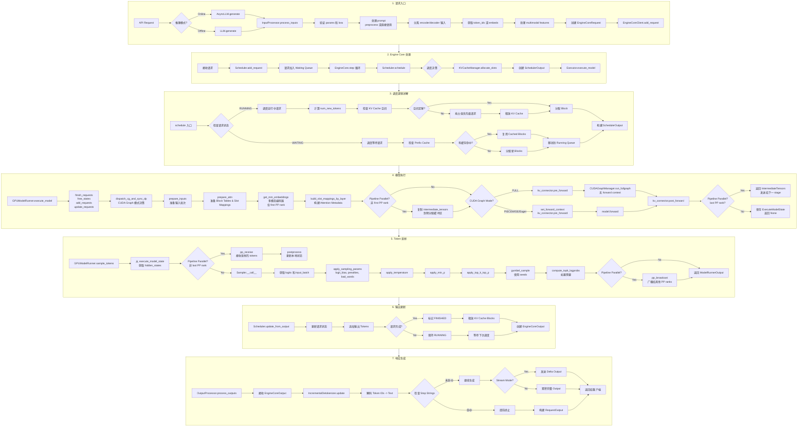
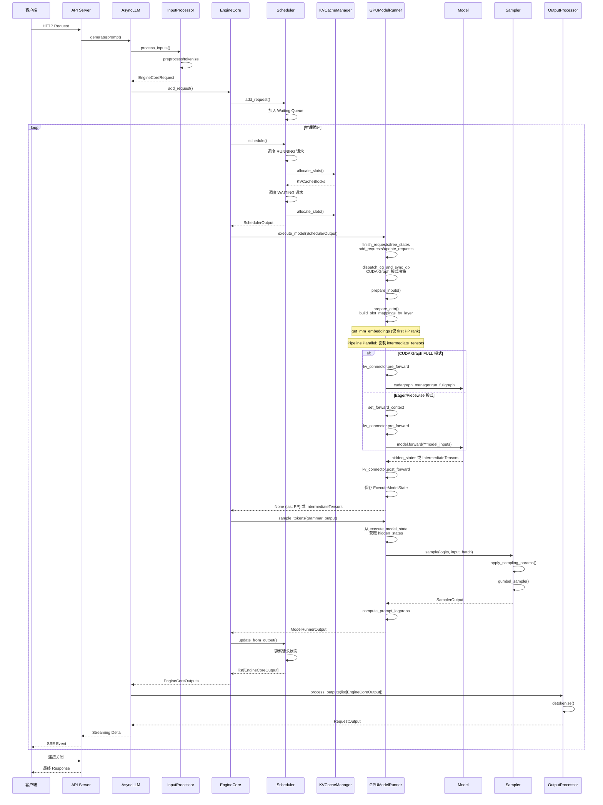

# vLLM V1 推理执行流程完整分析

## 1. 架构概览

vLLM V1 采用多进程架构设计，主要包括以下组件：

```
┌─────────────────────────────────────────────────────────────────────────┐
│                           API Server Process                            │
│  ┌──────────────┐    ┌──────────────┐    ┌──────────────────────────┐  │
│  │  FastAPI     │ -> │   AsyncLLM   │ -> │   InputProcessor         │  │
│  │  Endpoints   │    │   (Client)   │    │   (Tokenization)         │  │
│  └──────────────┘    └──────────────┘    └──────────────────────────┘  │
│                              │                    │                      │
│                              ▼                    ▼                      │
│                      ┌──────────────────────────────────────────────┐   │
│                      │           OutputProcessor                    │   │
│                      │   (Detokenization & Response Generation)    │   │
│                      └──────────────────────────────────────────────┘   │
└─────────────────────────────────────────────────────────────────────────┘
                              │
                              │ ZMQ IPC
                              ▼
┌─────────────────────────────────────────────────────────────────────────┐
│                          Engine Core Process                            │
│  ┌──────────────┐    ┌──────────────┐    ┌──────────────────────────┐  │
│  │  EngineCore  │ -> │   Scheduler  │ -> │   KVCacheManager         │  │
│  │  (Orchestr.) │    │   (Scheduling)│    │   (Block Allocation)    │  │
│  └──────────────┘    └──────────────┘    └──────────────────────────┘  │
│                              │                                          │
│                              ▼                                          │
│                      ┌──────────────────────────────────────────────┐   │
│                      │           Model Executor                      │   │
│                      └──────────────────────────────────────────────┘   │
└─────────────────────────────────────────────────────────────────────────┘
                              │
                              │ RPC / Collective
                              ▼
┌─────────────────────────────────────────────────────────────────────────┐
│                            GPU Worker Process                           │
│  ┌──────────────┐    ┌──────────────┐    ┌──────────────────────────┐  │
│  │ GPUModelRun. │ -> │    Model     │ -> │      Sampler             │  │
│  │ (Batch Prep) │    │  (Forward)   │    │   (Token Selection)      │  │
│  └──────────────┘    └──────────────┘    └──────────────────────────┘  │
│                              │                                          │
│                      ┌──────────────────────────────────────────────┐   │
│                      │         KV Cache (GPU Memory)                 │   │
│                      └──────────────────────────────────────────────┘   │
└─────────────────────────────────────────────────────────────────────────┘
```

---

## 2. 核心代码位置总览

### 2.1 入口点

| 文件路径 | 行号 | 功能说明 |
|---------|------|---------|
| `vllm/entrypoints/openai/api_server.py` | 77-106 | `build_async_engine_client` - 异步引擎客户端构建 |
| `vllm/entrypoints/openai/api_server.py` | 157-314 | `build_app` - FastAPI 应用构建 |
| `vllm/entrypoints/llm.py` | 106 | `LLM` 类 - 离线推理入口 |
| `vllm/v1/engine/async_llm.py` | 70-200 | `AsyncLLM` 类 - 异步引擎客户端 |
| `vllm/v1/engine/llm_engine.py` | 47 | `LLMEngine` 类 - 同步引擎 |

### 2.2 输入处理

| 文件路径 | 行号 | 功能说明 |
|---------|------|---------|
| `vllm/v1/engine/input_processor.py` | 36-374 | `InputProcessor` - 输入处理和分词 |
| `vllm/v1/engine/__init__.py` | 80-125 | `EngineCoreRequest` - 请求数据结构 |

### 2.3 调度器

| 文件路径 | 行号 | 功能说明 |
|---------|------|---------|
| `vllm/v1/core/sched/scheduler.py` | 67-300 | `Scheduler.__init__` - 初始化 |
| `vllm/v1/core/sched/scheduler.py` | 351-957 | `Scheduler.schedule` - 核心调度算法 |
| `vllm/v1/core/sched/scheduler.py` | 1302-1560 | `Scheduler.update_from_output` - 输出更新 |
| `vllm/v1/core/sched/scheduler.py` | 964-985 | `Scheduler._preempt_request` - 请求抢占 |
| `vllm/v1/core/sched/interface.py` | 36-245 | `SchedulerInterface` - 调度器接口 |
| `vllm/v1/core/sched/output.py` | 30-253 | `SchedulerOutput` - 调度输出数据结构 |
| `vllm/v1/core/sched/request_queue.py` | 13-199 | 请求队列实现 (FCFS/Priority) |

### 2.4 KV Cache 管理

| 文件路径 | 行号 | 功能说明 |
|---------|------|---------|
| `vllm/v1/core/kv_cache_manager.py` | 106-154 | `KVCacheManager.__init__` - 初始化 |
| `vllm/v1/core/kv_cache_manager.py` | 176-216 | `get_computed_blocks` - Prefix cache 命中查询 |
| `vllm/v1/core/kv_cache_manager.py` | 218-255 | `can_fit_full_sequence` - 空间预检查 |
| `vllm/v1/core/kv_cache_manager.py` | 257-427 | `allocate_slots` - Block 分配核心方法 |
| `vllm/v1/core/kv_cache_manager.py` | 429-437 | `free` - Block 释放 |
| `vllm/v1/core/kv_cache_utils.py` | 113-160 | `KVCacheBlock` - Cache Block 数据结构 |
| `vllm/v1/core/block_pool.py` | 130-183 | `BlockPool` - Block Pool 管理 |
| `vllm/v1/core/kv_cache_coordinator.py` | - | `KVCacheCoordinator` - Block 分配协调器 |

### 2.5 Engine Core

| 文件路径 | 行号 | 功能说明 |
|---------|------|---------|
| `vllm/v1/engine/core.py` | 91-230 | `EngineCore.__init__` - 引擎核心初始化 |
| `vllm/v1/engine/core.py` | 402-431 | `step()` - 核心执行步骤 |
| `vllm/v1/engine/core.py` | 806-1910 | `EngineCoreProc` / `DPEngineCoreProc` - 多进程引擎封装 |
| `vllm/v1/engine/core.py` | 1164-1173 | `EngineCoreProc.run_busy_loop` - 基础忙循环 |
| `vllm/v1/engine/core.py` | 1731-1785 | `DPEngineCoreProc.run_busy_loop` - DP 版本忙循环 |
| `vllm/v1/engine/core_client.py` | 69-272 | `EngineCoreClient` - 客户端通信接口 |

### 2.6 Model Runner

| 文件路径 | 行号 | 功能说明 |
|---------|------|---------|
| `vllm/v1/worker/gpu/model_runner.py` | 106-245 | `GPUModelRunner` 初始化 |
| `vllm/v1/worker/gpu/model_runner.py` | 955-1147 | `execute_model()` - 模型执行 |
| `vllm/v1/worker/gpu/model_runner.py` | 697-843 | `prepare_inputs()` - 输入准备 |
| `vllm/v1/worker/gpu/model_runner.py` | 1151-1271 | `sample_tokens()` - Token 采样 |

### 2.7 Attention 实现

| 文件路径 | 行号 | 功能说明 |
|---------|------|---------|
| `vllm/v1/attention/backend.py` | 55-343 | `AttentionBackend` - Attention 后端接口 |
| `vllm/v1/attention/backends/flash_attn.py` | 66-300 | FlashAttention 实现 |
| `vllm/v1/worker/gpu/block_table.py` | 13-170 | Block Tables 管理 |

### 2.8 Sampler

| 文件路径 | 行号 | 功能说明 |
|---------|------|---------|
| `vllm/v1/worker/gpu/sample/sampler.py` | 22-182 | `Sampler` - Token 采样器 |
| `vllm/v1/worker/gpu/sample/gumbel.py` | 163-197 | Gumbel Sampling 实现 |
| `vllm/v1/sample/ops/topk_topp_sampler.py` | - | TopK/TopP 采样操作 |

### 2.9 输出处理

| 文件路径 | 行号 | 功能说明 |
|---------|------|---------|
| `vllm/v1/engine/output_processor.py` | 572-687 | `OutputProcessor.process_outputs` - 输出处理 |
| `vllm/v1/engine/detokenizer.py` | 30-66 | `IncrementalDetokenizer` - 最小基类 |
| `vllm/v1/engine/detokenizer.py` | 68-165 | `BaseIncrementalDetokenizer` - 带停止字符串处理 |
| `vllm/v1/engine/detokenizer.py` | 167-243 | `FastIncrementalDetokenizer` - 快速解码 |
| `vllm/v1/engine/detokenizer.py` | 245-301 | `SlowIncrementalDetokenizer` - 慢速解码 |
| `vllm/v1/engine/detokenizer.py` | 304-340 | `check_stop_strings` - 停止字符串检查函数 |
| `vllm/v1/outputs.py` | 118-203 | `SamplerOutput`, `ModelRunnerOutput` |

---

## 3. 推理执行流程图



---

## 4. 详细流程说明

### 4.1 请求入口阶段

#### 4.1.1 API Server 接收请求

**文件**: `vllm/entrypoints/openai/api_server.py`

```python
# 构建异步引擎客户端 (Line 77-106)
# 注意：这是一个 async context manager，返回 AsyncIterator[EngineClient]
@asynccontextmanager
async def build_async_engine_client(
    args: Namespace,
    *,
    usage_context: UsageContext = UsageContext.OPENAI_API_SERVER,
    client_config: dict[str, Any] | None = None,
) -> AsyncIterator[EngineClient]:
    """构建异步引擎客户端，处理 forkserver 设置"""
    ...

# 构建 FastAPI 应用 (Line 157-314)
def build_app(
    args: Namespace,
    supported_tasks: tuple["SupportedTask", ...] | None = None,
    model_config: ModelConfig | None = None,
) -> FastAPI:
    """构建 FastAPI 应用，注册多个 API routers"""
    # 注册 routers: models, sagemaker, generate, render, transcription, realtime, pooling
    # 添加 middleware: Prometheus, HTTP logging, exception handling
    ...
```

#### 4.1.2 AsyncLLM 处理请求

**文件**: `vllm/v1/engine/async_llm.py`

```python
class AsyncLLM(EngineClient):
    def __init__(self, ...):
        # 初始化 InputProcessor (Line 135)
        self.input_processor = InputProcessor(self.vllm_config, renderer)
        
        # 初始化 OutputProcessor (Line 138-143)
        self.output_processor = OutputProcessor(
            renderer.tokenizer,
            log_stats=self.log_stats,
            ...
        )
        
        # 创建 EngineCoreClient (Line 146-153)
        self.engine_core = EngineCoreClient.make_async_mp_client(...)
        
        # 启动输出处理器 (Line 174)
        self._run_output_handler()
```

#### 4.1.3 输入处理

**文件**: `vllm/v1/engine/input_processor.py`

```python
class InputProcessor:
    def process_inputs(self, request_id, prompt, params, ...) -> EngineCoreRequest:
        """
        核心处理流程:
        1. 验证 sampling/pooling parameters
        2. 验证 LoRA request (如果存在)
        3. 检查 data_parallel_rank 范围
        4. 处理 prompt 输入:
           - 如果已是 EngineInput dict: 直接使用
           - 如果是原始 prompt: 调用 InputPreprocessor.preprocess() 分词
        5. 分离 encoder/decoder 输入 (encoder-decoder 模型)
        6. 验证模型输入长度
        7. 处理 prompt_token_ids 或 prompt_embeds
        8. 克隆并更新 sampling_params/pooling_params
        9. 处理 multimodal inputs (mm_features)
        10. 创建 EngineCoreRequest
        """
        # 1. 参数验证 (Line 248-249)
        self._validate_params(params, supported_tasks)
        self._validate_lora(lora_request)

        # 2. 处理 prompt (Line 261-286)
        if isinstance(prompt, dict) and "type" in prompt:
            # 已是预处理过的 EngineInput
            processed_inputs = prompt
        else:
            # 原始 prompt -> 调用 InputPreprocessor 分词
            processed_inputs = self.input_preprocessor.preprocess(prompt, ...)

        # 3. 分离 encoder/decoder 输入 (Line 290-291)
        encoder_inputs, decoder_inputs = split_enc_dec_input(processed_inputs)
        self._validate_model_inputs(encoder_inputs, decoder_inputs)

        # 4. 获取 token_ids 或 embeds (Line 294-299)
        if decoder_inputs["type"] == "embeds":
            prompt_token_ids = None
            prompt_embeds = decoder_inputs["prompt_embeds"]
        else:
            prompt_token_ids = decoder_inputs["prompt_token_ids"]
            prompt_embeds = None

        # 5. 处理 sampling_params (Line 301-318)
        if isinstance(params, SamplingParams):
            sampling_params = params.clone()
            # 设置 max_tokens (如果未指定)
            if sampling_params.max_tokens is None:
                sampling_params.max_tokens = max_model_len - seq_len
            # 更新 generation_config 和 tokenizer 配置
            sampling_params.update_from_generation_config(...)
            sampling_params.update_from_tokenizer(self.tokenizer)

        # 6. 处理 multimodal (Line 323-358)
        if decoder_inputs["type"] == "multimodal":
            mm_features = [...]  # 构建 MultiModalFeatureSpec

        # 7. 创建请求 (Line 360-374)
        return EngineCoreRequest(
            request_id=request_id,
            prompt_token_ids=prompt_token_ids,
            prompt_embeds=prompt_embeds,
            mm_features=mm_features,
            sampling_params=sampling_params,
            pooling_params=pooling_params,
            arrival_time=arrival_time,
            lora_request=lora_request,
            cache_salt=decoder_inputs.get("cache_salt"),
            priority=priority,
            data_parallel_rank=data_parallel_rank,
            trace_headers=trace_headers,
            resumable=resumable,
        )
```

**EngineCoreRequest 数据结构** (`vllm/v1/engine/__init__.py`, Line 80-124):

```python
class EngineCoreRequest(
    msgspec.Struct,
    array_like=True,    # 支持 array-like 序列化
    omit_defaults=True, # 序列化时省略默认值
    gc=False,           # 禁用垃圾回收
):
    """请求数据结构"""
    request_id: str                                    # Line 86
    prompt_token_ids: list[int] | None                 # Line 87
    mm_features: list[MultiModalFeatureSpec] | None    # Line 88
    sampling_params: SamplingParams | None             # Line 89
    pooling_params: PoolingParams | None               # Line 90
    arrival_time: float                                # Line 91
    lora_request: LoRARequest | None                   # Line 92
    cache_salt: str | None                             # Line 93
    data_parallel_rank: int | None                     # Line 94
    prompt_embeds: torch.Tensor | None = None          # Line 95 - 有默认值
    client_index: int = 0                              # Line 99
    current_wave: int = 0                              # Line 104
    priority: int = 0                                  # Line 105
    trace_headers: Mapping[str, str] | None = None     # Line 107
    resumable: bool = False                            # Line 108
    external_req_id: str | None = None                 # Line 114
    reasoning_ended: bool | None = None                # Line 116

    @property
    def params(self) -> SamplingParams | PoolingParams:
        """返回 processed params (sampling 或 pooling)"""
        if self.sampling_params is not None:
            return self.sampling_params
        assert self.pooling_params is not None
        return self.pooling_params
```

---

### 4.2 Engine Core 处理阶段

#### 4.2.1 EngineCore 初始化

**文件**: `vllm/v1/engine/core.py` (Line 91-230)

```python
class EngineCore:
    def __init__(self, vllm_config, executor_class, log_stats, ...):
        # 加载插件 (Line 103-105)
        from vllm.plugins import load_general_plugins
        load_general_plugins()

        self.vllm_config = vllm_config
        self.log_stats = log_stats

        # 初始化 Model Executor (Line 118)
        self.model_executor = executor_class(vllm_config)
        if executor_fail_callback is not None:
            self.model_executor.register_failure_callback(executor_fail_callback)

        # Elastic EP scale up (如果启用) (Line 124-125)
        if envs.VLLM_ELASTIC_EP_SCALE_UP_LAUNCH:
            self._eep_scale_up_before_kv_init()

        # 初始化 KV Cache (Line 128)
        kv_cache_config = self._initialize_kv_caches(vllm_config)

        # 初始化 Structured Output Manager (Line 129)
        self.structured_output_manager = StructuredOutputManager(vllm_config)

        # 获取 Scheduler 类 (Line 132)
        Scheduler = vllm_config.scheduler_config.get_scheduler_cls()

        # 解析 block sizes (Line 141-143)
        scheduler_block_size, hash_block_size = resolve_kv_cache_block_sizes(
            kv_cache_config, vllm_config
        )

        # 初始化 Scheduler (Line 145-153)
        self.scheduler: SchedulerInterface = Scheduler(
            vllm_config=vllm_config,
            kv_cache_config=kv_cache_config,
            structured_output_manager=self.structured_output_manager,
            include_finished_set=include_finished_set,
            log_stats=self.log_stats,
            block_size=scheduler_block_size,
            hash_block_size=hash_block_size,
        )

        # KV Connector 初始化 (Line 154-161)
        if self.vllm_config.kv_transfer_config is not None:
            self.kv_connector = ...
            self.mm_receiver_cache = ...

        # KV Connector handshake metadata (Line 166-182)
        if self.kv_connector is not None:
            self.kv_connector_handshake_metadata = ...

        # Request block hasher (for prefix caching) (Line 202-211)
        self.request_block_hasher = ...

        # 设置 batch queue (用于 PP) (Line 188-194)
        self.batch_queue_size = self.model_executor.max_concurrent_batches
        if self.batch_queue_size > 1:
            self.batch_queue = deque(maxlen=self.batch_queue_size)

        # Step function选择和async scheduling配置 (Line 213-229)
        self.step_fn = self.step
        self.async_scheduling = ...
        self.aborts_queue = ...
```

#### 4.2.2 核心 Step 循环

**文件**: `vllm/v1/engine/core.py` (Line 402-431)

```python
def step(self) -> tuple[dict[int, EngineCoreOutputs], bool]:
    """核心执行步骤: 调度 -> 执行 -> 输出"""

    # 1. 检查是否有请求 (Line 411)
    if not self.scheduler.has_requests():
        return {}, False

    # 2. 调度请求 (Line 413)
    scheduler_output = self.scheduler.schedule()

    # 3. 执行模型 (Line 414-425)
    future = self.model_executor.execute_model(scheduler_output, non_block=True)
    grammar_output = self.scheduler.get_grammar_bitmask(scheduler_output)

    # 使用 context managers 记录错误和迭代详情 (Line 416-419)
    with (
        self.log_error_detail(scheduler_output),
        self.log_iteration_details(scheduler_output),
    ):
        model_output = future.result()

    if model_output is None:
        model_output = self.model_executor.sample_tokens(grammar_output)

    # 4. 处理 aborts queue (Line 426)
    self._process_aborts_queue()

    # 5. 更新调度器状态 (Line 427-429)
    engine_core_outputs = self.scheduler.update_from_output(
        scheduler_output, model_output
    )

    return engine_core_outputs, scheduler_output.total_num_scheduled_tokens > 0
```

#### 4.2.3 多进程引擎循环

**文件**: `vllm/v1/engine/core.py`

**基础 EngineCoreProc (Line 1164-1173):**
```python
class EngineCoreProc:
    def run_busy_loop(self):
        """Engine Core 进程主循环 (基础版本)"""
        while self._handle_shutdown():
            # 1) Poll the input queue
            self._process_input_queue()
            # 2) Step the engine core
            self._process_engine_step()
        raise SystemExit
```

**DPEngineCoreProc (Line 1731-1785):**
```python
class DPEngineCoreProc(EngineCoreProc):
    def run_busy_loop(self):
        """DP 版本主循环 - 包含负载均衡和同步"""
        while self._handle_shutdown():
            # 处理输入队列
            self._process_input_queue()

            # 执行引擎步骤
            executed = self._process_engine_step()

            # 发布请求计数 (用于 DP 负载均衡)
            self._maybe_publish_request_counts()

            # DP 同步检查
            self.engines_running = self._has_global_unfinished_reqs(...)
```

---

### 4.3 调度逻辑详解

#### 4.3.1 Scheduler 初始化

**文件**: `vllm/v1/core/sched/scheduler.py` (Line 68-300)

```python
class Scheduler(SchedulerInterface):
    def __init__(
        self,
        vllm_config: VllmConfig,
        kv_cache_config: KVCacheConfig,
        structured_output_manager: StructuredOutputManager,
        block_size: int,
        hash_block_size: int | None = None,
        mm_registry: MultiModalRegistry = MULTIMODAL_REGISTRY,
        include_finished_set: bool = False,
        log_stats: bool = False,
    ) -> None:
        # 配置引用 (Line 79-87)
        self.vllm_config = vllm_config
        self.scheduler_config = vllm_config.scheduler_config
        self.cache_config = vllm_config.cache_config
        self.kv_cache_config = kv_cache_config

        # 调度约束 (Line 105-112)
        self.max_num_running_reqs = self.scheduler_config.max_num_seqs
        self.max_num_scheduled_tokens = (
            self.scheduler_config.max_num_scheduled_tokens
            if self.scheduler_config.max_num_scheduled_tokens
            else self.scheduler_config.max_num_batched_tokens
        )
        self.max_model_len = vllm_config.model_config.max_model_len

        # KV Connector 创建 (Line 118-138)
        # 用于 P/D disaggregation 和 KV offloading
        self.connector = None
        if self.vllm_config.kv_transfer_config is not None:
            self.connector = KVConnectorFactory.create_connector(
                config=self.vllm_config,
                role=KVConnectorRole.SCHEDULER,
                kv_cache_config=self.kv_cache_config,
            )

        # KV Events Publisher (Line 140-143)
        self.kv_event_publisher = EventPublisherFactory.create(
            self.kv_events_config,
            self.parallel_config.data_parallel_index,
        )

        # EC Connector 创建 (Line 144-148)
        if self.vllm_config.ec_transfer_config is not None:
            self.ec_connector = ECConnectorFactory.create_connector(...)

        # Block size 和 Context Parallel 配置 (Line 153-155)
        self.block_size = block_size
        self.dcp_world_size = vllm_config.parallel_config.decode_context_parallel_size
        self.pcp_world_size = vllm_config.parallel_config.prefill_context_parallel_size

        # 请求存储 (Line 157-170)
        self.requests: dict[str, Request] = {}  # req_id -> Request

        # 调度策略 (Line 160-165)
        self.policy = SchedulingPolicy(self.scheduler_config.policy)

        # 请求队列 (Line 167-170)
        self.waiting = create_request_queue(self.policy)      # 等待队列
        self.skipped_waiting = create_request_queue(self.policy)  # 被跳过的等待队列
        self.running: list[Request] = []                      # 运行队列
        self.finished_req_ids: set[str] = set()               # 已完成请求 IDs

        # Encoder Cache Manager (Line 186-212)
        self.max_num_encoder_input_tokens = mm_budget.encoder_compute_budget if mm_budget else 0
        self.encoder_cache_manager = (
            EncoderDecoderCacheManager(cache_size=encoder_cache_size)
            if self.is_encoder_decoder
            else EncoderCacheManager(cache_size=encoder_cache_size)
        )

        # Speculative Decoding 配置 (Line 214-223)
        self.use_eagle = False
        self.num_spec_tokens = self.num_lookahead_tokens = 0
        if speculative_config:
            self.num_spec_tokens = speculative_config.num_speculative_tokens
            if speculative_config.use_eagle():
                self.use_eagle = True
                self.num_lookahead_tokens = self.num_spec_tokens

        # KV Cache Manager 创建 (Line 225-245)
        self.kv_cache_manager = KVCacheManager(
            kv_cache_config=kv_cache_config,
            max_model_len=self.max_model_len,
            enable_caching=self.cache_config.enable_prefix_caching,
            use_eagle=self.use_eagle,
            log_stats=self.log_stats,
            enable_kv_cache_events=self.enable_kv_cache_events,
            dcp_world_size=self.dcp_world_size,
            pcp_world_size=self.pcp_world_size,
            hash_block_size=hash_block_size,
        )

        # Mamba 相关配置 (Line 253-257)
        self.has_mamba_layers = kv_cache_config.has_mamba_layers
        self.need_mamba_block_aligned_split = (
            self.has_mamba_layers and self.cache_config.mamba_cache_mode == "align"
        )
```

#### 4.3.2 调度核心逻辑

**文件**: `vllm/v1/core/sched/scheduler.py` (Line 351-957)

```python
def schedule(self) -> SchedulerOutput:
    """主调度算法

    NOTE: 调度器没有单独的 "decoding phase" 或 "prefill phase"。
    每个请求只有 num_computed_tokens 和 num_tokens_with_spec。
    调度器的目标是在每一步为请求分配 tokens，使其 num_computed_tokens
    能追上 num_tokens_with_spec。这涵盖了 chunked prefill、prefix caching、
    speculative decoding 等场景。
    """
vllm_inference_execution_flow.md
    # 初始化调度状态 (Line 363-383)
    scheduled_new_reqs: list[Request] = []
    scheduled_resumed_reqs: list[Request] = []
    scheduled_running_reqs: list[Request] = []
    preempted_reqs: list[Request] = []
    req_to_new_blocks: dict[str, KVCacheBlocks] = {}
    num_scheduled_tokens: dict[str, int] = {}
    token_budget = self.max_num_scheduled_tokens
    encoder_compute_budget = self.max_num_encoder_input_tokens
    scheduled_spec_decode_tokens: dict[str, list[int]] = {}
    scheduled_encoder_inputs: dict[str, list[int]] = {}

    # KV Cache Manager 新步骤开始 (Line 384)
    self.kv_cache_manager.new_step_starts()

    # ===== 1. 调度 RUNNING 请求 (Line 386-555) =====
    # 使用索引迭代而非 for 循环，支持抢占时动态调整
    req_index = 0
    while req_index < len(self.running) and token_budget > 0:
        request = self.running[req_index]

        # 异步调度优化：避免调度额外步骤 (Line 391-405)
        if request.num_output_placeholders > 0 and \
           request.num_computed_tokens + 2 - request.num_output_placeholders \
           >= request.num_prompt_tokens + request.max_tokens:
            req_index += 1
            continue

        # 计算需要处理的 token 数 (Line 407-411)
        # 注意：包含 num_output_placeholders (spec decode placeholder)
        num_new_tokens = (
            request.num_tokens_with_spec
            + request.num_output_placeholders
            - request.num_computed_tokens
        )

        # Chunked Prefill: 长提示词分块处理 (Line 412-414)
        if 0 < self.scheduler_config.long_prefill_token_threshold < num_new_tokens:
            num_new_tokens = self.scheduler_config.long_prefill_token_threshold

        num_new_tokens = min(num_new_tokens, token_budget)

        # 确保 input position 不超过 max_model_len (Line 418-420)
        num_new_tokens = min(
            num_new_tokens,
            self.max_model_len - 1 - request.num_computed_tokens
        )

        # 调度 encoder inputs (多模态模型) (Line 422-438)
        if request.has_encoder_inputs:
            encoder_inputs_to_schedule, num_new_tokens, \
            new_encoder_compute_budget, external_load_encoder_input = \
                self._try_schedule_encoder_inputs(request, ...)

        # Mamba block 对齐分割 (Line 440-443)
        if self.need_mamba_block_aligned_split:
            num_new_tokens = self._mamba_block_aligned_split(request, num_new_tokens)

        if num_new_tokens == 0:
            req_index += 1
            continue

        # 分配 KV Cache Blocks (Line 464-510)
        while True:
            new_blocks = self.kv_cache_manager.allocate_slots(
                request,
                num_new_tokens,
                num_lookahead_tokens=self.num_lookahead_tokens,
            )

            if new_blocks is not None:
                break  # 成功分配

            # 分配失败，需要抢占其他请求 (Line 477-509)
            if self.policy == SchedulingPolicy.PRIORITY:
                # 优先级策略：抢占优先级最低的请求
                preempted_req = max(
                    self.running,
                    key=lambda r: (r.priority, r.arrival_time),
                )
                self.running.remove(preempted_req)
                # 恢复已分配的资源
                if preempted_req in scheduled_running_reqs:
                    token_budget += num_scheduled_tokens.pop(preempted_req.request_id)
                    req_to_new_blocks.pop(preempted_req.request_id)
                    scheduled_spec_decode_tokens.pop(preempted_req.request_id, None)
                    # 恢复 encoder compute budget
                    ...
                req_index -= 1  # 调整索引
            else:
                # FCFS 策略：抢占队尾请求
                preempted_req = self.running.pop()

            self._preempt_request(preempted_req, scheduled_timestamp)
            preempted_reqs.append(preempted_req)

            if preempted_req == request:
                break  # 无法抢占更多请求

        if new_blocks is None:
            break  # 无法调度此请求

        # 成功调度，更新状态 (Line 515-554)
        scheduled_running_reqs.append(request)
        req_to_new_blocks[request.request_id] = new_blocks
        num_scheduled_tokens[request.request_id] = num_new_tokens
        token_budget -= num_new_tokens
        req_index += 1

        # Speculative decode: 记录 draft tokens (Line 524-539)
        if request.spec_token_ids:
            scheduled_spec_decode_tokens[request.request_id] = spec_token_ids
            request.spec_token_ids = []

        # Encoder inputs 分配 (Line 541-554)
        if encoder_inputs_to_schedule:
            scheduled_encoder_inputs[request.request_id] = encoder_inputs_to_schedule
            for i in encoder_inputs_to_schedule:
                self.encoder_cache_manager.allocate(request, i)

    # 记录已调度的 LoRAs (Line 556-564)
    scheduled_loras: set[int] = set()

    # ===== 2. 调度 WAITING 请求 (Line 566-858) =====
    if not preempted_reqs and self._pause_state == PauseState.UNPAUSED:
        step_skipped_waiting = create_request_queue(self.policy)

        # 同时检查 waiting 和 skipped_waiting 队列
        while (self.waiting or self.skipped_waiting) and token_budget > 0:
            if len(self.running) == self.max_num_running_reqs:
                break  # 达到最大并发请求限制

            # 选择合适的队列进行调度
            request_queue = self._select_waiting_queue_for_scheduling()
            request = request_queue.peek_request()
            request_id = request.request_id

            # 处理 blocked 状态请求 (Line 580-591)
            if self._is_blocked_waiting_status(request.status):
                if not self._try_promote_blocked_waiting_request(request):
                    request_queue.pop_request()
                    step_skipped_waiting.prepend_request(request)
                    continue

            # LoRA 约束检查 (Line 593-606)
            if self.lora_config and request.lora_request:
                if len(scheduled_loras) == self.lora_config.max_loras \
                   and request.lora_request.lora_int_id not in scheduled_loras:
                    request_queue.pop_request()
                    step_skipped_waiting.prepend_request(request)
                    continue

            num_external_computed_tokens = 0
            load_kv_async = False

            # 获取已缓存的 tokens (Prefix Cache) (Line 613-655)
            if request.num_computed_tokens == 0:
                # 本地 Prefix Cache
                new_computed_blocks, num_new_local_computed_tokens = \
                    self.kv_cache_manager.get_computed_blocks(request)

                # KV Connector: 远程 KV Cache (Line 619-641)
                if self.connector is not None:
                    ext_tokens, load_kv_async = \
                        self.connector.get_num_new_matched_tokens(request, ...)
                    num_external_computed_tokens = ext_tokens or 0

                # 总 computed tokens (本地 + 远程)
                num_computed_tokens = \
                    num_new_local_computed_tokens + num_external_computed_tokens

                # 记录 prefill 统计信息
                if request.prefill_stats is not None:
                    request.prefill_stats.set(...)
            else:
                # 已有 computed tokens (KV Transfer 场景)
                new_computed_blocks = self.kv_cache_manager.empty_kv_cache_blocks
                num_computed_tokens = request.num_computed_tokens

            # 异步 KV 加载场景 (Line 667-670)
            if load_kv_async:
                num_new_tokens = 0
            else:
                # 计算需要新处理的 token 数 (Line 672-691)
                # 使用 request.num_tokens 考虑 resumed 请求的 output tokens
                num_new_tokens = request.num_tokens - num_computed_tokens

                # Chunked Prefill threshold
                threshold = self.scheduler_config.long_prefill_token_threshold
                if 0 < threshold < num_new_tokens:
                    num_new_tokens = threshold

                # 非 chunked prefill 模式：token_budget 不足时停止
                if not self.scheduler_config.enable_chunked_prefill \
                   and num_new_tokens > token_budget:
                    break

                num_new_tokens = min(num_new_tokens, token_budget)

                # 调度 encoder inputs (Line 694-710)
                if request.has_encoder_inputs:
                    encoder_inputs_to_schedule, num_new_tokens, ... = \
                        self._try_schedule_encoder_inputs(request, ...)

            # Mamba block 对齐 (Line 712-720)
            if self.need_mamba_block_aligned_split:
                num_new_tokens = self._mamba_block_aligned_split(...)

            # 检查是否可以容纳完整序列 (Line 743-755)
            if self.scheduler_reserve_full_isl \
               and not self.kv_cache_manager.can_fit_full_sequence(request, ...):
                break

            # 分配 KV Cache (Line 757-775)
            new_blocks = self.kv_cache_manager.allocate_slots(
                request,
                num_new_tokens,
                num_new_computed_tokens=num_new_local_computed_tokens,
                new_computed_blocks=new_computed_blocks,
                num_lookahead_tokens=effective_lookahead_tokens,
                num_external_computed_tokens=num_external_computed_tokens,
                delay_cache_blocks=load_kv_async,
            )

            if new_blocks is None:
                if request.has_encoder_inputs:
                    self.encoder_cache_manager.free(request)
                break  # 空间不足，停止调度

            # KV Connector 状态更新 (Line 781-795)
            if self.connector is not None:
                self.connector.update_state_after_alloc(request, ...)

            # 从队列取出请求 (Line 797)
            request = request_queue.pop_request()

            # 异步 KV 加载：设置为 WAITING_FOR_REMOTE_KVS 状态 (Line 798-817)
            if load_kv_async:
                request.status = RequestStatus.WAITING_FOR_REMOTE_KVS
                step_skipped_waiting.prepend_request(request)
                request.num_computed_tokens = num_computed_tokens
                continue

            # 移动到 Running 队列 (Line 819-838)
            self.running.append(request)
            request.status = RequestStatus.RUNNING
            request.num_computed_tokens = num_computed_tokens

            # 分类请求状态 (Line 824-829)
            if request.status == RequestStatus.WAITING:
                scheduled_new_reqs.append(request)
            elif request.status == RequestStatus.PREEMPTED:
                scheduled_resumed_reqs.append(request)

            # 记录 LoRA 和更新状态 (Line 831-854)
            if self.lora_config and request.lora_request:
                scheduled_loras.add(request.lora_request.lora_int_id)
            req_to_new_blocks[request_id] = \
                self.kv_cache_manager.get_blocks(request_id)
            num_scheduled_tokens[request_id] = num_new_tokens
            token_budget -= num_new_tokens

        # 重新入队 skipped 请求 (Line 857-858)
        if step_skipped_waiting:
            self.skipped_waiting.prepend_requests(step_skipped_waiting)

    # ===== 3. 验证调度约束 (Line 860-871) =====
    total_num_scheduled_tokens = sum(num_scheduled_tokens.values())
    assert total_num_scheduled_tokens <= self.max_num_scheduled_tokens
    assert len(self.running) <= self.max_num_running_reqs

    # ===== 4. 计算公共前缀 blocks (Line 873-881) =====
    num_common_prefix_blocks = [0] * len(self.kv_cache_config.kv_cache_groups)
    if self.running:
        num_common_prefix_blocks = \
            self.kv_cache_manager.get_num_common_prefix_blocks(any_request_id)

    # ===== 5. 构建 SchedulerOutput (Line 883-938) =====
    # V2 Model Runner 分支处理
    if self.use_v2_model_runner:
        scheduled_new_reqs = scheduled_new_reqs + scheduled_resumed_reqs
        scheduled_resumed_reqs = []

    # 构建 NewRequestData
    new_reqs_data = [
        NewRequestData.from_request(
            req,
            req_to_new_blocks[req.request_id].get_block_ids(),
        )
        for req in scheduled_new_reqs
    ]

    # 构建 CachedRequestData
    cached_reqs_data = self._make_cached_request_data(
        scheduled_running_reqs,
        scheduled_resumed_reqs,
        num_scheduled_tokens,
        scheduled_spec_decode_tokens,
        req_to_new_blocks,
    )

    # 记录已调度请求 IDs (Line 912-914)
    self.prev_step_scheduled_req_ids.clear()
    self.prev_step_scheduled_req_ids.update(num_scheduled_tokens.keys())

    # 构建 SchedulerOutput (Line 922-938)
    scheduler_output = SchedulerOutput(
        scheduled_new_reqs=new_reqs_data,
        scheduled_cached_reqs=cached_reqs_data,
        num_scheduled_tokens=num_scheduled_tokens,
        total_num_scheduled_tokens=total_num_scheduled_tokens,
        scheduled_spec_decode_tokens=scheduled_spec_decode_tokens,
        scheduled_encoder_inputs=scheduled_encoder_inputs,
        num_common_prefix_blocks=num_common_prefix_blocks,
        preempted_req_ids={req.request_id for req in preempted_reqs},
        finished_req_ids=self.finished_req_ids,
        free_encoder_mm_hashes=self.encoder_cache_manager.get_freed_mm_hashes(),
        new_block_ids_to_zero=new_block_ids_to_zero,
    )

    # ===== 6. KV/EC Connector Metadata (Line 944-953) =====
    if self.connector is not None:
        scheduler_output.kv_connector_metadata = \
            self._build_kv_connector_meta(self.connector, scheduler_output)

    if self.ec_connector is not None:
        scheduler_output.ec_connector_metadata = \
            self.ec_connector.build_connector_meta(scheduler_output)

    # ===== 7. 后调度更新 (Line 955-957) =====
    self._update_after_schedule(scheduler_output)
    return scheduler_output
```

**关键调度特性说明:**

| 特性 | 行号 | 说明 |
|------|------|------|
| 异步调度优化 | 391-405 | 避免 num_output_placeholders 导致的额外步骤 |
| Chunked Prefill | 412-414, 677-679 | 长提示词分块，避免 decode 延迟 |
| Speculative Decoding | 524-539 | draft tokens 处理和记录 |
| Encoder Inputs | 422-438, 694-710 | 多模态 encoder 调度 |
| Mamba Block 对齐 | 440-443, 712-720 | Mamba 状态缓存的 block 对齐 |
| Priority Preemption | 477-509 | 优先级抢占而非 FCFS 队尾抢占 |
| Prefix Cache | 613-655 | 本地和远程 KV Cache 前缀复用 |
| KV Connector | 619-641, 781-795 | 异步 KV 加载和状态管理 |
| LoRA Constraints | 593-606 | max_loras 约束检查 |
| Blocked Status | 580-591 | WAITING_FOR_REMOTE_KVS 状态处理 |
| Common Prefix | 873-881 | Cascade Attention 公共前缀计算 |

#### 4.3.3 KV Cache 分配

**文件**: `vllm/v1/core/kv_cache_manager.py` (Line 257-427)

```python
class KVCacheManager:
    def allocate_slots(
        self,
        request: Request,
        num_new_tokens: int,
        num_new_computed_tokens: int = 0,
        new_computed_blocks: KVCacheBlocks | None = None,
        num_lookahead_tokens: int = 0,
        num_external_computed_tokens: int = 0,
        delay_cache_blocks: bool = False,
        num_encoder_tokens: int = 0,
    ) -> KVCacheBlocks | None:
        """为请求分配 KV Cache slots

        注意：prefix cache 命中的 blocks 由 scheduler 在调用本方法前
        通过 get_computed_blocks() 获取，然后传入 new_computed_blocks 参数。

        Block 布局:
        ----------------------------------------------------------------------
        | < comp > | < new_comp > | < ext_comp >  | < new >  | < lookahead > |
        ----------------------------------------------------------------------
                                      |            < to be allocated >           |
        ----------------------------------------------------------------------
                                      | < to be cached (prefix cache hash)>       |
        ----------------------------------------------------------------------
        | Prefix-cached tokens from either vLLM or connector.              |
        | Can be safely removed if outside sliding window.                  |
        ----------------------------------------------------------------------
        |   < cached by vLLM >    |              | not cached by vLLM, but     |
        | ref_cnt increased       | ref_cnt not  | cached by connector          |
        |                         | increased yet|                              |
        ----------------------------------------------------------------------

        缩写:
        comp      = request.num_computed_tokens (已计算 tokens)
        new_comp  = num_new_computed_tokens (新 prefix cache 命中)
        ext_comp  = num_external_computed_tokens (KV Connector 远程缓存)
        new       = num_new_tokens (要计算的新 tokens)
        lookahead = num_lookahead_tokens (Spec decode lookahead)
        """

        # ===== 1. 参数验证 =====
        if num_new_tokens == 0 and num_external_computed_tokens == 0:
            raise ValueError(
                "num_new_tokens must be greater than 0 when there are no "
                "external computed tokens"
            )
        # 异步 KV 加载时允许 num_new_tokens=0

        # ===== 2. 处理 prefix cache blocks =====
        if new_computed_blocks is not None:
            new_computed_block_list = new_computed_blocks.blocks
        else:
            new_computed_block_list = self.empty_kv_cache_blocks.blocks

        # ===== 3. 计算 token 数量 =====
        num_local_computed_tokens = (
            request.num_computed_tokens + num_new_computed_tokens
        )
        total_computed_tokens = min(
            num_local_computed_tokens + num_external_computed_tokens,
            self.max_model_len,
        )
        num_tokens_main_model = total_computed_tokens + num_new_tokens
        num_tokens_need_slot = min(
            num_tokens_main_model + num_lookahead_tokens,
            self.max_model_len,
        )

        # ===== 4. 释放跳过的 blocks (Sliding Window) =====
        # 移除 sliding window 之外的旧 blocks
        self.coordinator.remove_skipped_blocks(
            request.request_id, total_computed_tokens
        )

        # ===== 5. 计算需要分配的 block 数量 =====
        num_blocks_to_allocate = self.coordinator.get_num_blocks_to_allocate(
            request_id=request.request_id,
            num_tokens=num_tokens_need_slot,
            new_computed_blocks=new_computed_block_list,
            num_encoder_tokens=num_encoder_tokens,
            total_computed_tokens=num_local_computed_tokens
                + num_external_computed_tokens,
            num_tokens_main_model=num_tokens_main_model,
        )

        # ===== 6. 检查空间是否足够 =====
        if num_blocks_to_allocate > self.block_pool.get_num_free_blocks():
            return None  # 空间不足，scheduler 会触发抢占

        # ===== 7. 分配 prefix cache blocks =====
        # 将 prefix cache 命中的 blocks 分给请求，增加 ref_cnt
        if (
            new_computed_block_list is not self.empty_kv_cache_blocks.blocks
            or num_external_computed_tokens > 0
        ):
            self.coordinator.allocate_new_computed_blocks(
                request_id=request.request_id,
                new_computed_blocks=new_computed_block_list,
                num_local_computed_tokens=num_local_computed_tokens,
                num_external_computed_tokens=num_external_computed_tokens,
            )

        # ===== 8. 分配新的 blocks =====
        new_blocks = self.coordinator.allocate_new_blocks(
            request.request_id,
            num_tokens_need_slot,
            num_tokens_main_model,
            num_encoder_tokens,
        )

        # ===== 9. 缓存 blocks (计算 hash) =====
        # P/D 异步加载: delay_cache_blocks=True 时跳过缓存
        if not self.enable_caching or delay_cache_blocks:
            return self.create_kv_cache_blocks(new_blocks)

        # 只缓存 finalized tokens，不缓存 draft tokens
        num_tokens_to_cache = min(
            total_computed_tokens + num_new_tokens,
            request.num_tokens,  # cap at finalized tokens
        )
        self.coordinator.cache_blocks(request, num_tokens_to_cache)

        return self.create_kv_cache_blocks(new_blocks)

    def get_computed_blocks(self, request: Request) -> tuple[KVCacheBlocks, int]:
        """获取 prefix cache 命中的 blocks (Line 176-216)

        由 scheduler 在 allocate_slots 之前调用，
        结果传入 allocate_slots 的 new_computed_blocks 参数。

        Returns:
            (KVCacheBlocks, num_new_computed_tokens) - 命中的 blocks 和 token 数
        """
        if not self.enable_caching or request.skip_reading_prefix_cache:
            return self.empty_kv_cache_blocks, 0

        # 注意：全命中时需重计算最后一个 token (获取 logits)
        max_cache_hit_length = request.num_tokens - 1

        computed_blocks, num_new_computed_tokens = (
            self.coordinator.find_longest_cache_hit(
                request.block_hashes, max_cache_hit_length
            )
        )

        return self.create_kv_cache_blocks(computed_blocks), num_new_computed_tokens
```

**KV Cache 分配三阶段流程：**

| 阶段 | 操作 | 说明 |
|------|------|------|
| Stage 1 | `remove_skipped_blocks` | 释放 sliding window 外的 blocks |
| Stage 2 | `allocate_new_computed_blocks` | 分配 prefix cache 命中的 blocks，增加 ref_cnt |
| Stage 3 | `allocate_new_blocks` | 从 block_pool 分配新的 blocks |

**关键参数说明：**

| 参数 | 来源 | 用途 |
|------|------|------|
| `num_new_computed_tokens` | `get_computed_blocks()` 返回 | 本地 prefix cache 命中 |
| `new_computed_blocks` | `get_computed_blocks()` 返回 | 命中的 blocks |
| `num_lookahead_tokens` | Scheduler 计算 | Spec decode lookahead |
| `num_external_computed_tokens` | KV Connector 计算 | 远程 KV 缓存 |
| `delay_cache_blocks` | Scheduler 设置 | P/D 异步加载 |
| `num_encoder_tokens` | Encoder inputs 计算 | Encoder-decoder 模型 |

**与 Scheduler 的调用关系：**

```python
# Scheduler.schedule() 中的调用顺序:
# 1. 先获取 prefix cache 命中
new_computed_blocks, num_new_computed_tokens = \
    self.kv_cache_manager.get_computed_blocks(request)

# 2. 再分配 slots，传入命中的 blocks
blocks = self.kv_cache_manager.allocate_slots(
    request,
    num_new_tokens,
    num_new_computed_tokens=num_new_computed_tokens,
    new_computed_blocks=new_computed_blocks,
    num_lookahead_tokens=self.num_lookahead_tokens,
    num_external_computed_tokens=num_external_computed_tokens,
    ...
)
```

---

### 4.4 模型执行阶段

#### 4.4.1 GPUModelRunner 执行

**文件**: `vllm/v1/worker/gpu/model_runner.py` (Line 954-1147)

```python
@torch.inference_mode()
def execute_model(
    self,
    scheduler_output: SchedulerOutput,
    intermediate_tensors: IntermediateTensors | None = None,  # PP 中间张量
    dummy_run: bool = False,
    skip_attn_for_dummy_run: bool = False,
    is_profile: bool = False,
) -> ModelRunnerOutput | IntermediateTensors | None:
    """执行模型 forward pass

    注意:
    - last PP rank: 返回 None，状态保存到 execute_model_state 供 sample_tokens() 使用
    - non-last PP rank: 返回 IntermediateTensors 传递给下一 stage
    - non-first PP rank: 接收 intermediate_tensors 作为输入而非 input_ids
    """

    # ===== 1. 更新请求状态 (Line 963-969) =====
    if not dummy_run:
        self.finish_requests(scheduler_output)  # 清理已完成请求
        self.free_states(scheduler_output)      # 释放 encoder cache
        self.add_requests(scheduler_output)     # 添加新请求状态
        self.update_requests(scheduler_output)  # 更新 block IDs
        self.block_tables.apply_staged_writes() # 应用 staged block table writes

        # 空调度处理 (Line 970-973)
        if scheduler_output.total_num_scheduled_tokens == 0:
            return self.kv_connector.no_forward(scheduler_output)

    # ===== 2. 准备批次描述符和 DP 同步 (Line 976-996) =====
    num_reqs = len(scheduler_output.num_scheduled_tokens)
    num_toks = scheduler_output.total_num_scheduled_tokens
    max_query_len = max(scheduler_output.num_scheduled_tokens.values())
    uniform_tok_count = get_uniform_token_count(num_reqs, num_toks, max_query_len)

    # Encoder-decoder 模型特殊处理 (Line 982-986)
    # 当有 encoder inputs 时跳过编译，因为需要动态更新 cross-attention cache
    skip_compiled = False
    if self.is_encoder_decoder and scheduler_output.scheduled_encoder_inputs:
        skip_compiled = True

    # CUDA Graph 模式决策 + DP 同步 (Line 988-996)
    batch_desc, num_tokens_across_dp = dispatch_cg_and_sync_dp(
        self.cudagraph_manager, num_reqs, num_toks, uniform_tok_count,
        self.dp_size, self.dp_rank, need_eager=is_profile or skip_compiled,
    )

    # ===== 3. 准备输入批次 (Line 1003-1016) =====
    if not dummy_run:
        input_batch = self.prepare_inputs(scheduler_output, batch_desc)
        block_tables, slot_mappings = self.prepare_attn(input_batch)

        # LoRA 激活 (Line 1009-1016)
        if self.lora_config:
            lora_inputs = self.lora_state.make_lora_inputs(...)
            self._set_active_loras(*lora_inputs)
    else:
        # Dummy run (DP padding 或 memory profiling)
        input_batch = InputBatch.make_dummy(...)
        ...

    # ===== 4. 构建 Attention Metadata (Line 1035-1050) =====
    if not (dummy_run and skip_attn_for_dummy_run):
        slot_mappings_by_layer = build_slot_mappings_by_layer(
            slot_mappings, self.kv_cache_config
        )
        attn_metadata = self.model_state.prepare_attn(
            input_batch, batch_desc.cg_mode, block_tables,
            slot_mappings, self.attn_groups, self.kv_cache_config,
        )

    # ===== 5. Multimodal Embeddings 处理 (Line 1052-1062) =====
    # 仅 first PP rank 处理 multimodal inputs
    inputs_embeds = None
    if self.supports_mm_inputs and self.is_first_pp_rank:
        inputs_embeds = self.model_state.get_mm_embeddings(
            scheduler_output.scheduled_encoder_inputs,
            input_batch, self.req_states,
        )

    # ===== 6. 构建 Model Inputs (Line 1064-1071) =====
    model_inputs = {
        "input_ids": input_batch.input_ids,
        "positions": input_batch.positions,
        "inputs_embeds": inputs_embeds,
        **self.model_state.prepare_inputs(input_batch, self.req_states),
    }

    # ===== 7. Pipeline Parallel 中间张量处理 (Line 1072-1087) =====
    if not self.is_first_pp_rank:
        # Non-first PP rank: 接收上一 stage 的输出作为输入
        model_inputs["input_ids"] = None
        model_inputs["inputs_embeds"] = None

        # 将 intermediate_tensors 复制到预分配缓冲区 (原地操作)
        n = input_batch.num_tokens_after_padding
        model_inputs["intermediate_tensors"] = IntermediateTensors(
            {
                k: v[:n].copy_(intermediate_tensors.tensors[k][:n])
                for k, v in self.intermediate_tensors.tensors.items()
            }
        )
        del intermediate_tensors  # 释放传入的张量

    # ===== 8. 执行模型 forward (Line 1089-1115) =====
    # 关键区别: FULL CUDA Graph 模式不使用 set_forward_context
    if batch_desc.cg_mode == CUDAGraphMode.FULL:
        # FULL CUDA Graph 重放 (Line 1090-1096)
        # 注意: 输入已复制到 CUDA graph buffer，无需传入
        self.kv_connector.pre_forward(scheduler_output)  # 在 context 外调用
        model_output = self.cudagraph_manager.run_fullgraph(batch_desc)
    else:
        # Eager 或 Piecewise 模式 (Line 1097-1115)
        batch_descriptor = BatchDescriptor(
            num_tokens=input_batch.num_tokens_after_padding,
            has_lora=self.lora_config is not None,
        )
        with set_forward_context(
            attn_metadata,
            self.vllm_config,
            num_tokens=input_batch.num_tokens_after_padding,
            cudagraph_runtime_mode=batch_desc.cg_mode,
            num_tokens_across_dp=num_tokens_across_dp,
            batch_descriptor=batch_descriptor,
            slot_mapping=slot_mappings_by_layer,
            skip_compiled=skip_compiled,
        ):
            self.kv_connector.pre_forward(scheduler_output)  # 在 context 内调用
            model_output = self.model(**model_inputs)

    # ===== 9. 处理 Model Output (Line 1117-1131) =====
    if self.is_last_pp_rank:
        # Last PP rank: 提取 hidden states
        if self.use_aux_hidden_state_outputs:
            hidden_states, aux_hidden_states = model_output  # tuple
        else:
            hidden_states = model_output  # 单个 Tensor
            aux_hidden_states = None
        output_intermediate_tensors = None
    else:
        # Non-last PP rank: 输出 IntermediateTensors 传递给下一 stage
        hidden_states = None
        aux_hidden_states = None
        output_intermediate_tensors = model_output

    # ===== 10. KV Connector post_forward (Line 1132) =====
    kv_connector_output = self.kv_connector.post_forward(scheduler_output)

    # ===== 11. 保存执行状态供 sample_tokens() 使用 (Line 1133-1139) =====
    # 关键: last PP rank 返回 None，状态保存此处
    self.execute_model_state = ExecuteModelState(
        input_batch=input_batch,
        attn_metadata=attn_metadata,
        slot_mappings_by_layer=slot_mappings_by_layer,
        hidden_states=hidden_states,
        aux_hidden_states=aux_hidden_states,
        kv_connector_output=kv_connector_output,
    )

    # ===== 12. 返回结果 (Line 1142-1147) =====
    if not self.is_last_pp_rank:
        # Non-last PP rank: 返回 IntermediateTensors 发送给下一 stage
        output_intermediate_tensors.kv_connector_output = kv_connector_output
        return output_intermediate_tensors
    return None  # Last PP rank: 状态已保存，等待 sample_tokens() 调用
```

**执行流程关键说明:**

| 步骤 | 行号 | 说明 |
|------|------|------|
| 请求状态更新 | 963-969 | finish/free/add/update 请求状态 |
| Batch Descriptor | 988-996 | CUDA Graph 模式决策 + DP 同步 |
| Attention Metadata | 1035-1050 | 构建 slot_mapping 和 attn_metadata |
| Multimodal Embeddings | 1052-1062 | 仅 first PP rank 处理 MM encoder |
| PP 中间张量 | 1072-1087 | Non-first PP rank 接收并复制 intermediate_tensors |
| Model Forward | 1089-1115 | FULL 模式无 forward context，其他模式有 |
| Output 处理 | 1117-1131 | Last PP rank 提取 hidden_states，其他返回 IntermediateTensors |
| KV Connector post | 1132 | 执行后更新 KV Connector 状态 |
| 状态保存 | 1133-1139 | 保存 ExecuteModelState 供 sample_tokens() |
| 返回值 | 1142-1147 | Last PP rank 返回 None，其他返回 IntermediateTensors |

**CUDA Graph 模式区别:**

| 模式 | set_forward_context | kv_connector.pre_forward 位置 |
|------|---------------------|------------------------------|
| FULL | 不使用 | 在 forward context 外调用 |
| PIECEWISE/NONE | 使用 | 在 forward context 内调用 |

**Pipeline Parallel 执行流程:**

```
Stage 0 (First PP Rank):
    input_ids/positions -> Model.forward -> IntermediateTensors -> 发送给 Stage 1

Stage 1..N-1 (Middle PP Ranks):
    接收 IntermediateTensors -> 复制到缓冲区 -> Model.forward -> IntermediateTensors -> 发送

Stage N (Last PP Rank):
    接收 IntermediateTensors -> 复制到缓冲区 -> Model.forward -> hidden_states
    -> 保存到 execute_model_state -> 返回 None -> 等待 sample_tokens()
```

**关键设计: execute_model 和 sample_tokens 分离**

- `execute_model()`: 执行 forward pass，保存状态，返回 None (last PP rank)
- `sample_tokens()`: 从 execute_model_state 取 hidden_states，执行采样

分离原因:
1. 允许 forward 和 sampling 在不同时机执行 (PP 场景)
2. 支持 speculative decoding 多 token 验证
3. 减少内存压力 (hidden_states 可在 sampling 前释放)

#### 4.4.2 输入准备

**文件**: `vllm/v1/worker/gpu/model_runner.py` (Line 697-843)

```python
def prepare_inputs(
    self,
    scheduler_output: SchedulerOutput,
    batch_desc: BatchExecutionDescriptor
) -> InputBatch:
    """准备模型输入批次

    关键步骤:
    1. 按 token 数排序请求 (decode first, prefill later)
    2. 处理 draft tokens (speculative decoding)
    3. 构建 query_start_loc (cumsum)
    4. 准备 prefill tokens (Triton kernel)
    5. 准备 positions 和 seq_lens
    6. DCP (Decode Context Parallel) 处理
    7. 合并 sampled 和 draft tokens
    8. 构建 InputBatch
    """

    # ===== 1. 按 token 数排序请求 (Line 708) =====
    # Decode requests (1 token) first, prefill later
    req_ids = sorted(num_tokens_per_req, key=num_tokens_per_req.get)
    num_scheduled_tokens = np.fromiter(
        map(num_tokens_per_req.get, req_ids), dtype=np.int32, count=num_reqs
    )

    # ===== 2. 索引映射 (Line 712-714) =====
    # req_id -> request state index
    idx_mapping_np = np.fromiter(
        map(self.req_states.req_id_to_index.get, req_ids),
        dtype=np.int32, count=num_reqs
    )
    idx_mapping = async_copy_to_gpu(idx_mapping_np, device=self.device)

    # ===== 3. Draft tokens 处理 (Line 717-748) =====
    draft_tokens = scheduler_output.scheduled_spec_decode_tokens
    if not draft_tokens:
        # 无 draft tokens (常见情况)
        total_num_draft_tokens = 0
        total_num_logits = num_reqs
        cu_num_logits_np = np.arange(num_reqs + 1, dtype=np.int32)
        expanded_idx_mapping = idx_mapping
        expanded_local_pos = torch.zeros(num_reqs, dtype=torch.int32, device=self.device)
    else:
        # 有 draft tokens (speculative decoding)
        # 计算每个请求的 draft token 数量
        num_draft_tokens = np.fromiter(
            (len(draft_tokens.get(req_id, ())) for req_id in req_ids),
            dtype=np.int32, count=num_reqs,
        )
        total_num_draft_tokens = int(num_draft_tokens.sum())
        total_num_logits = num_reqs + total_num_draft_tokens

        # 构建 cu_num_logits (cumsum for logits)
        num_logits = num_draft_tokens + 1
        cu_num_logits_np = np.empty(num_reqs + 1, dtype=np.int32)
        cu_num_logits_np[0] = 0
        np.cumsum(num_logits, out=cu_num_logits_np[1:])

        # 扩展索引映射 (draft token 验证需要)
        expanded_idx_mapping, expanded_local_pos = expand_idx_mapping(
            idx_mapping, total_num_logits, cu_num_logits, max_expand_len
        )

    # ===== 4. 构建 query_start_loc (Line 750-761) =====
    # 每个请求的 token 起始位置 (cumsum)
    num_reqs_padded = batch_desc.num_reqs or num_reqs  # CUDA Graph padding
    query_start_loc_np = np.empty(self.max_num_reqs + 1, dtype=np.int32)
    query_start_loc_np[0] = 0
    np.cumsum(num_scheduled_tokens, out=query_start_loc_np[1 : num_reqs + 1])
    query_start_loc_np[num_reqs + 1 :] = num_tokens  # Pad for CUDA Graph
    async_copy_to_gpu(query_start_loc_np, out=self.input_buffers.query_start_loc)

    # ===== 5. Prefill tokens (Line 764-773) =====
    # Triton kernel 复制 prefill token IDs
    if self.req_states.any_prefills(idx_mapping_np):
        prepare_prefill_inputs(
            self.input_buffers.input_ids,
            self.req_states.next_prefill_tokens,
            idx_mapping, query_start_loc,
            self.req_states.all_token_ids.gpu,
            self.req_states.prefill_len.gpu,
            self.req_states.num_computed_tokens.gpu,
        )

    # ===== 6. Positions 和 seq_lens (Line 775-783) =====
    prepare_pos_seq_lens(
        idx_mapping, query_start_loc,
        self.req_states.num_computed_tokens.gpu,
        self.input_buffers.positions,
        self.input_buffers.seq_lens,
    )

    # ===== 7. DCP (Decode Context Parallel) 处理 (Line 785-796) =====
    # 如果启用 DCP，准备 local seq_lens
    if self.use_dcp:
        prepare_dcp_local_seq_lens(
            self.input_buffers.dcp_local_seq_lens,
            self.input_buffers.seq_lens,
            num_reqs, self.dcp_size, self.dcp_rank, self.cp_interleave,
        )

    # ===== 8. 合并 sampled 和 draft tokens (Line 800-810) =====
    # Decode tokens 从 last_sampled_tokens 和 draft_tokens 获取
    logits_indices = combine_sampled_and_draft_tokens(
        self.input_buffers.input_ids,
        idx_mapping,
        self.req_states.last_sampled_tokens,
        query_start_loc, seq_lens,
        self.req_states.prefill_len.gpu,
        self.req_states.draft_tokens,
        cu_num_logits, total_num_logits,
    )

    # ===== 9. seq_lens CPU upper bound (Line 812-819) =====
    # 用于 CPU 端验证
    seq_lens_cpu_upper_bound_np = np.zeros(num_reqs_padded, dtype=np.int32)
    np.add(
        self.req_states.num_computed_tokens_np[idx_mapping_np],
        num_scheduled_tokens,
        out=seq_lens_cpu_upper_bound_np[:num_reqs],
    )

    # ===== 10. 构建 InputBatch (Line 820-843) =====
    return InputBatch(
        req_ids=req_ids,
        num_reqs=num_reqs,
        num_reqs_after_padding=num_reqs_padded,
        idx_mapping=idx_mapping,
        idx_mapping_np=idx_mapping_np,
        expanded_idx_mapping=expanded_idx_mapping,
        expanded_local_pos=expanded_local_pos,
        num_scheduled_tokens=num_scheduled_tokens,
        num_tokens=num_tokens,
        num_tokens_after_padding=num_tokens_after_padding,
        num_draft_tokens=total_num_draft_tokens,
        query_start_loc=query_start_loc,
        query_start_loc_np=query_start_loc_np,
        seq_lens=seq_lens,
        seq_lens_cpu_upper_bound=seq_lens_cpu_upper_bound,
        dcp_local_seq_lens=dcp_local_seq_lens,
        input_ids=self.input_buffers.input_ids[:num_tokens_after_padding],
        positions=self.input_buffers.positions[:num_tokens_after_padding],
        logits_indices=logits_indices,
        cu_num_logits=cu_num_logits,
        cu_num_logits_np=cu_num_logits_np,
        has_structured_output_reqs=scheduler_output.has_structured_output_requests,
    )
```

**InputBatch 关键字段说明:**

| 字段 | 类型 | 说明 |
|------|------|------|
| `req_ids` | list[str] | 排序后的请求 IDs |
| `idx_mapping` | torch.Tensor | GPU 索引映射 (req_index -> state_index) |
| `expanded_idx_mapping` | torch.Tensor | 扩展索引映射 (spec decode) |
| `query_start_loc` | torch.Tensor | Token 起始位置 cumsum (GPU) |
| `seq_lens` | torch.Tensor | 序列长度 (GPU) |
| `input_ids` | torch.Tensor | Token IDs (GPU) |
| `positions` | torch.Tensor | Position IDs (GPU) |
| `logits_indices` | torch.Tensor | 需要计算 logits 的 token 索引 |
| `cu_num_logits` | torch.Tensor | Logits cumsum (用于 logprobs) |
| `num_draft_tokens` | int | Draft token 总数 |

**Speculative Decoding 输入处理流程:**

```
Draft Model 生成 N 个 draft tokens
    -> Target Model 需验证 N+1 个位置
    -> expanded_idx_mapping 将 N+1 个 logits 映射到请求
    -> cu_num_logits 记录每个请求的 logits 数量 (N+1)
    -> 验证后可能接受 1 到 N+1 个 tokens
```

#### 4.4.3 Attention Metadata 构建

**文件**: `vllm/v1/worker/gpu/attn_utils.py` (Line 239-295)

```python
def build_attn_metadata(common_attn_metadata: CommonAttentionMetadata, ...):
    """构建 Attention Metadata"""
    
    # 从通用 metadata 构建
    common = CommonAttentionMetadata(
        query_start_loc=query_start_loc,  # 每个请求的 token 起始位置
        seq_lens=seq_lens,                # 每个请求的序列长度
        block_table_tensor=block_table,   # Block table (KV cache 映射)
        slot_mapping=slot_mapping,        # Slot mapping (KV cache slot ID)
    )
    
    # 构建 per-layer metadata
    return attn_metadata_builder.build(common, ...)
```

---

### 4.5 Token 采样阶段

#### 4.5.1 Sampler 采样流程

**文件**: `vllm/v1/worker/gpu/sample/sampler.py` (核心入口)

Sampler 采样流程主要分为以下几个关键步骤：

1. **参数准备**：从输入批次中提取索引映射、位置信息等关键参数
2. **采样参数应用**：应用各种采样参数（logit bias、penalties、bad words masking、temperature、min_p、top_k/top_p）
3. **Gumbel 采样**：使用 Gumbel 采样算法生成下一个 token
4. **logprobs 计算**（可选）：根据需要计算 token 的 log probabilities
5. **结果构建**：构建并返回 SamplerOutput

```python
class Sampler:
    def __call__(
        self,
        logits: torch.Tensor,
        input_batch: InputBatch,
    ) -> SamplerOutput:
        # 1. 参数准备
        expanded_idx_mapping = input_batch.expanded_idx_mapping
        idx_mapping_np = input_batch.idx_mapping_np
        pos = input_batch.positions[input_batch.logits_indices]
        input_ids = input_batch.input_ids[input_batch.logits_indices]
        
        # 2. 采样前的 NaN 检测
        num_nans = get_num_nans(logits) if self.compute_nans else None
        
        # 3. 执行采样（包含参数应用和实际采样）
        sampled, processed_logits = self.sample(
            logits, expanded_idx_mapping, idx_mapping_np,
            pos, input_ids, expanded_local_pos
        )

        # 4. logprobs 计算（如需要）
        max_num_logprobs = self.sampling_states.max_num_logprobs(idx_mapping_np)
        if max_num_logprobs != NO_LOGPROBS:
            if self.logprobs_mode == "processed_logprobs":
                logits = processed_logits
            expanded_logits = logits.shape[0] != idx_mapping_np.shape[0]
            cu_num_logits = cu_num_logits_np.tolist() if expanded_logits else None
            logprobs_tensors = compute_topk_logprobs(
                logits, max_num_logprobs, sampled, cu_num_logits
            )
        else:
            logprobs_tensors = None

        # 5. 构建返回结果
        return SamplerOutput(
            sampled_token_ids=sampled.view(-1, 1),
            logprobs_tensors=logprobs_tensors,
            num_nans=num_nans,
        )

    def sample(
        self,
        logits: torch.Tensor,
        expanded_idx_mapping: torch.Tensor,
        idx_mapping_np: np.ndarray,
        pos: torch.Tensor,
        input_ids: torch.Tensor,
        expanded_local_pos: torch.Tensor,
    ) -> tuple[torch.Tensor, torch.Tensor]:
        # 应用所有采样参数
        processed_logits = self.apply_sampling_params(
            logits, expanded_idx_mapping, idx_mapping_np,
            pos, input_ids, expanded_local_pos
        )

        # 执行 Gumbel 采样
        sampled = gumbel_sample(
            processed_logits,
            expanded_idx_mapping,
            self.sampling_states.temperature.gpu,
            self.sampling_states.seeds.gpu,
            pos,
            apply_temperature=False
        )
        return sampled, processed_logits

    def apply_sampling_params(
        self,
        logits: torch.Tensor,
        expanded_idx_mapping: torch.Tensor,
        idx_mapping_np: np.ndarray,
        pos: torch.Tensor,
        input_ids: torch.Tensor,
        expanded_local_pos: torch.Tensor,
    ) -> torch.Tensor:
        # 复制 logits 为 FP32 格式
        logits = torch.empty_like(logits, dtype=torch.float32).copy_(logits)

        # 依次应用各类采样参数
        self.logit_bias_state.apply_logit_bias(logits, expanded_idx_mapping, idx_mapping_np, pos)
        self.penalties_state.apply_penalties(logits, expanded_idx_mapping, idx_mapping_np,
                                             input_ids, expanded_local_pos,
                                             self.num_speculative_tokens)
        self.bad_words_state.apply_bad_words(logits, expanded_idx_mapping, idx_mapping_np,
                                             input_ids, expanded_local_pos)
        self.sampling_states.apply_temperature(logits, expanded_idx_mapping, idx_mapping_np)
        self.sampling_states.apply_min_p(logits, expanded_idx_mapping, idx_mapping_np)
        return self.sampling_states.apply_top_k_top_p(logits, expanded_idx_mapping, idx_mapping_np)
```

#### 4.5.2 Gumbel Sampling (优化实现)

**文件**: `vllm/v1/worker/gpu/sample/gumbel.py` (核心实现)

Gumbel 采样是 vLLM 中实现随机 token 采样的关键组件，采用高效的 Triton kernel 实现：

**执行流程**：
1. **初始化**：为每个 token 分配内存存储局部最大值和索引
2. **并行计算**：使用 Triton kernel 并行处理每个 token 的 logits
3. **Gumbel 噪声添加**：为每个 token 添加 Gumbel 噪声
4. **采样决策**：对每个 token 在其词汇表中选出具有最高加权值的 token

**核心实现逻辑**：
```python
def gumbel_sample(
    logits: torch.Tensor,  # [num_tokens, vocab_size]
    expanded_idx_mapping: torch.Tensor,  # [num_tokens]
    temperature: torch.Tensor,  # [max_num_reqs]
    seed: torch.Tensor,  # [max_num_reqs]
    pos: torch.Tensor,  # [num_tokens]
    apply_temperature: bool,
    processed_logits_out: torch.Tensor | None = None,  # [num_reqs, vocab_size]
) -> torch.Tensor:
    num_tokens, vocab_size = logits.shape
    BLOCK_SIZE = 1024
    num_blocks = triton.cdiv(vocab_size, BLOCK_SIZE)
    local_argmax = logits.new_empty(num_tokens, num_blocks, dtype=torch.int64)
    local_max = logits.new_empty(num_tokens, num_blocks, dtype=torch.float64)
    _gumbel_sample_kernel[(num_tokens, num_blocks)](
        local_argmax,
        local_argmax.stride(0),
        local_max,
        local_max.stride(0),
        processed_logits_out,
        processed_logits_out.stride(0) if processed_logits_out is not None else 0,
        logits,
        logits.stride(0),
        expanded_idx_mapping,
        seed,
        pos,
        temperature,
        vocab_size,
        BLOCK_SIZE=BLOCK_SIZE,
        APPLY_TEMPERATURE=apply_temperature,
    )
    # NOTE(woosuk): Use int64 for later indexing.
    max_block_idx = local_max.argmax(dim=-1, keepdim=True)
    sampled = local_argmax.gather(dim=-1, index=max_block_idx).view(-1)
    return sampled
```

**关键优化特性**：
- 使用 Triton kernel 实现并行计算，提高性能
- 支持温度参数应用（temperature scaling）
- 为每个请求使用不同的随机种子保证采样多样性
- 采用分块处理方式，适配不同大小的词汇表
- 支持保存处理后的 logits 供后续 logprobs 计算使用

### 4.6 输出更新阶段

#### 4.6.1 Scheduler 更新

**文件**: `vllm/v1/core/sched/scheduler.py` (Line 1302-1560)

```python
def update_from_output(
    self,
    scheduler_output: SchedulerOutput,
    model_runner_output: ModelRunnerOutput,
) -> dict[int, EngineCoreOutputs]:
    """从模型输出更新调度器状态"""

    # 提取输出数据 (Line 1307-1314)
    sampled_token_ids = model_runner_output.sampled_token_ids
    logprobs = model_runner_output.logprobs
    prompt_logprobs_dict = model_runner_output.prompt_logprobs_dict
    num_scheduled_tokens = scheduler_output.num_scheduled_tokens
    pooler_outputs = model_runner_output.pooler_output
    num_nans_in_logits = model_runner_output.num_nans_in_logits
    kv_connector_output = model_runner_output.kv_connector_output

    outputs: dict[int, list[EngineCoreOutput]] = defaultdict(list)
    stopped_running_reqs: set[Request] = set()
    stopped_preempted_reqs: set[Request] = set()

    # 处理 KV load 失败的请求 (Line 1331-1338)
    failed_kv_load_req_ids = None
    if kv_connector_output and kv_connector_output.invalid_block_ids:
        failed_kv_load_req_ids = self._handle_invalid_blocks(
            kv_connector_output.invalid_block_ids,
            num_scheduled_tokens,
        )

    # ===== 核心循环：迭代 num_scheduled_tokens (Line 1345-1487) =====
    # 注意：迭代 num_scheduled_tokens 而非 sampled_token_ids
    for req_id, num_tokens_scheduled in num_scheduled_tokens.items():
        if failed_kv_load_req_ids and req_id in failed_kv_load_req_ids:
            continue  # 跳过 KV load 失败的请求

        request = self.requests.get(req_id)
        if request is None or request.is_finished():
            continue  # 请求已 abort 或 finished

        # 获取生成的 token IDs (Line 1361-1364)
        req_index = model_runner_output.req_id_to_index[req_id]
        generated_token_ids = (
            sampled_token_ids[req_index] if sampled_token_ids else []
        )

        # ===== Speculative Decoding rejection 处理 (Line 1366-1390) =====
        scheduled_spec_token_ids = \
            scheduler_output.scheduled_spec_decode_tokens.get(req_id)
        if scheduled_spec_token_ids and generated_token_ids:
            num_draft_tokens = len(scheduled_spec_token_ids)
            num_accepted = len(generated_token_ids) - 1
            num_rejected = num_draft_tokens - num_accepted

            # 被拒绝的 tokens 需要回退 num_computed_tokens
            if request.num_computed_tokens > 0:
                request.num_computed_tokens -= num_rejected
            if request.num_output_placeholders > 0:
                request.num_output_placeholders -= num_rejected

            # 记录 spec decoding 统计
            spec_decoding_stats = self.make_spec_decoding_stats(...)

        # 释放 encoder inputs (Line 1392-1394)
        if request.has_encoder_inputs:
            self._free_encoder_inputs(request)

        stopped = False
        new_token_ids = generated_token_ids
        pooler_output = pooler_outputs[req_index] if pooler_outputs else None

        # ===== 更新请求并检查是否停止 (Line 1404-1411) =====
        if new_token_ids:
            new_token_ids, stopped = self._update_request_with_output(
                request, new_token_ids
            )
        elif request.pooling_params and pooler_output is not None:
            # Pooling 任务有输出即停止
            request.status = RequestStatus.FINISHED_STOPPED
            stopped = True

        # ===== Structured Output Grammar 检查 (Line 1413-1428) =====
        if new_token_ids and self.structured_output_manager.should_advance(request):
            struct_output_request = request.structured_output_request
            if not struct_output_request.grammar.accept_tokens(req_id, new_token_ids):
                # Grammar 拒绝 tokens，终止请求
                request.status = RequestStatus.FINISHED_ERROR
                request.resumable = False
                stopped = True

        finish_reason = None
        if stopped:
            finish_reason = request.get_finished_reason()
            finished = self._handle_stopped_request(request)
            if finished:
                kv_transfer_params = self._free_request(request)

            # 分类停止的请求
            if status_before_stop == RequestStatus.RUNNING:
                stopped_running_reqs.add(request)
            else:
                stopped_preempted_reqs.add(request)

        # ===== 提取 logprobs (Line 1448-1456) =====
        new_logprobs = None
        if request.sampling_params and \
           request.sampling_params.logprobs is not None and logprobs:
            new_logprobs = logprobs.slice_request(req_index, len(new_token_ids))

        if num_nans_in_logits is not None and req_id in num_nans_in_logits:
            request.num_nans_in_logits = num_nans_in_logits[req_id]

        # ===== 构建 EngineCoreOutput (Line 1466-1483) =====
        prompt_logprobs_tensors = prompt_logprobs_dict.get(req_id)
        if new_token_ids or pooler_output is not None \
           or kv_transfer_params or stopped:
            outputs[request.client_index].append(
                EngineCoreOutput(
                    request_id=req_id,
                    new_token_ids=new_token_ids,
                    finish_reason=finish_reason,
                    new_logprobs=new_logprobs,
                    new_prompt_logprobs_tensors=prompt_logprobs_tensors,
                    pooling_output=pooler_output,
                    stop_reason=request.stop_reason,
                    events=request.take_events(),
                    prefill_stats=request.take_prefill_stats(),
                    kv_transfer_params=kv_transfer_params,
                    trace_headers=request.trace_headers,
                    routed_experts=routed_experts,
                    num_nans_in_logits=request.num_nans_in_logits,
                )
            )

    # ===== 从队列移除停止的请求 (Line 1488-1493) =====
    if stopped_running_reqs:
        self.running = remove_all(self.running, stopped_running_reqs)
    if stopped_preempted_reqs:
        self.waiting.remove_requests(stopped_preempted_reqs)

    # ===== KV Load 失败处理 (Line 1495-1507) =====
    if failed_kv_load_req_ids and not self.recompute_kv_load_failures:
        self.finish_requests(failed_kv_load_req_ids, RequestStatus.FINISHED_ERROR)

    # ===== KV Connector 状态更新 (Line 1509-1511) =====
    if kv_connector_output:
        self._update_from_kv_xfer_finished(kv_connector_output)

    # ===== 收集并发布 KV Cache events (Line 1513-1528) =====
    events = self.kv_cache_manager.take_events()
    if self.connector is not None:
        connector_events = self.connector.take_events()
        if connector_events:
            events.extend(connector_events)
    if events:
        self.kv_event_publisher.publish(KVEventBatch(ts=time.time(), events=events))

    # ===== 构建 EngineCoreOutputs (Line 1530-1549) =====
    engine_core_outputs = {
        client_index: EngineCoreOutputs(outputs=outs)
        for client_index, outs in outputs.items()
    }

    # 添加 finished_req_ids (用于 multi-engine 场景)
    finished_req_ids = self.finished_req_ids_dict
    if finished_req_ids:
        for client_index, finished_set in finished_req_ids.items():
            if (eco := engine_core_outputs.get(client_index)) is not None:
                eco.finished_requests = finished_set
            else:
                engine_core_outputs[client_index] = EngineCoreOutputs(
                    finished_requests=finished_set
                )
        finished_req_ids.clear()

    return engine_core_outputs
```

**关键更新逻辑说明:**

| 步骤 | 行号 | 说明 |
|------|------|------|
| 迭代 num_scheduled_tokens | 1345 | 确保所有调度请求都被处理 |
| Spec Decoding Rejection | 1366-1390 | 回退被拒绝 draft tokens 的 computed_tokens |
| Encoder Inputs 释放 | 1392-1394 | 执行后释放 encoder cache |
| Structured Output | 1413-1428 | Grammar 约束检查，拒绝非法 tokens |
| 停止请求分类 | 1442-1445 | 区分 RUNNING 和 PREEMPTED 停止 |
| Logprobs 提取 | 1448-1456 | 按需提取 sampling logprobs |
| KV Cache Events | 1513-1528 | 收集并发布 block 分配/释放事件 |
| Multi-client Outputs | 1530-1549 | 按 client_index 组织输出 |

---

### 4.7 响应生成阶段

#### 4.7.1 OutputProcessor 处理

**文件**: `vllm/v1/engine/output_processor.py` (Line 572-687)

```python
class OutputProcessor:
    def process_outputs(
        self,
        engine_core_outputs: list[EngineCoreOutput],
        engine_core_timestamp: float | None = None,
        iteration_stats: IterationStats | None = None,
    ) -> OutputProcessorOutput:
        """处理引擎输出，生成响应

        注意: 输入是 list[EngineCoreOutput]，不是 EngineCoreOutputs
        """

        request_outputs = []
        reqs_to_abort = []

        for engine_core_output in engine_core_outputs:
            req_id = engine_core_output.request_id
            req_state = self.request_states.get(req_id)
            if req_state is None:
                continue  # 已 abort 的请求

            # 1. 更新统计信息 (Line 609-612)
            self._update_stats_from_output(req_state, engine_core_output, ...)

            # 获取输出数据 (Line 614-619)
            new_token_ids = engine_core_output.new_token_ids
            pooling_output = engine_core_output.pooling_output
            finish_reason = engine_core_output.finish_reason
            stop_reason = engine_core_output.stop_reason

            # 更新 prefill 状态 (Line 621-626)
            if req_state.is_prefilling:
                req_state.num_cached_tokens = engine_core_output.prefill_stats.num_cached_tokens
                req_state.is_prefilling = False

            # 2. Detokenize (如果是生成任务) (Line 628-637)
            if pooling_output is None:
                stop_string = req_state.detokenizer.update(
                    new_token_ids, finish_reason == FinishReason.STOP
                )
                if stop_string:
                    finish_reason = FinishReason.STOP
                    stop_reason = stop_string

                # 3. 更新 logprobs (Line 641)
                req_state.logprobs_processor.update_from_output(engine_core_output)

            # 4. 创建 RequestOutput (Line 644-661)
            request_output = req_state.make_request_output(
                new_token_ids, pooling_output, finish_reason, stop_reason, ...
            )

            if request_output:
                if req_state.queue is not None:
                    # AsyncLLM: 放入队列
                    req_state.queue.put(request_output)
                else:
                    # LLMEngine: 返回列表
                    request_outputs.append(request_output)

            # 5. 处理完成请求 (Line 663-682)
            if finish_reason is not None:
                if req_state.streaming_input:
                    # 流式输入: 处理队列中的下一个 chunk
                    ...
                else:
                    self._finish_request(req_state)
                    if not engine_core_output.finished:
                        reqs_to_abort.append(req_id)

        return OutputProcessorOutput(request_outputs=request_outputs, reqs_to_abort=reqs_to_abort)
```

#### 4.7.2 Incremental Detokenizer 类层次

**文件**: `vllm/v1/engine/detokenizer.py`

vLLM 使用多层次的 detokenizer 架构，而非单一的 IncrementalDetokenizer 类：

```python
# ===== 基础类 (Line 30-66) =====
class IncrementalDetokenizer:
    """最小基类 - 仅追踪 token_ids"""
    def __init__(self):
        self.token_ids: list[int] = []

    @property
    def output_token_ids(self) -> list[int]:
        return self.token_ids

    def update(self, new_token_ids: list[int], stop_terminated: bool) -> str | None:
        """追加新 tokens，返回 None (基类不解码)"""
        self.token_ids.extend(new_token_ids)
        return None

    def get_next_output_text(self, finished: bool, delta: bool) -> str:
        """基类返回空字符串"""
        return ""

# ===== 带停止字符串处理的基类 (Line 68-165) =====
class BaseIncrementalDetokenizer(IncrementalDetokenizer):
    """添加停止字符串处理"""
    def __init__(self, tokenizer, stop, include_stop_str_in_output):
        self.tokenizer = tokenizer
        self.stop = stop
        self.include_stop_str_in_output = include_stop_str_in_output
        ...

    def update(self, new_token_ids: list[int], stop_terminated: bool) -> str | None:
        """更新并返回解码文本"""
        ...

# ===== 快速解码实现 (Line 167-243) =====
class FastIncrementalDetokenizer(BaseIncrementalDetokenizer):
    """使用 DecodeStream 进行快速增量解码"""
    def __init__(self, tokenizer, stop, include_stop_str_in_output):
        self.decode_stream = DecodeStream(tokenizer)
        ...

# ===== 慢速解码实现 (Line 245-301) =====
class SlowIncrementalDetokenizer(BaseIncrementalDetokenizer):
    """Python 增量解码 (fallback)"""
    ...

# ===== 停止字符串检查函数 (Line 304-340) =====
def check_stop_strings(
    output_text: str,
    new_char_count: int,
    stop: list[str],
    include_in_output: bool,
) -> tuple[str, int] | None:
    """检查停止字符串 (独立函数，非类方法)

    使用 find() 进行偏移匹配，而非 endswith()
    """
    for stop_str in stop:
        stop_index = output_text.find(
            stop_str,
            1 - new_char_count - len(stop_str)
        )
        if stop_index != -1:
            ...
            return (output_text[:stop_index], stop_index)
    return None
```

**关键设计说明:**

| 类/函数 | 行号 | 用途 |
|--------|------|------|
| `IncrementalDetokenizer` | 30-66 | 最小基类，仅追踪 token_ids |
| `BaseIncrementalDetokenizer` | 68-165 | 添加停止字符串处理 |
| `FastIncrementalDetokenizer` | 167-243 | 快速路径，使用 DecodeStream |
| `SlowIncrementalDetokenizer` | 245-301 | Fallback，纯 Python 实现 |
| `check_stop_strings()` | 304-340 | **独立函数**，使用 find() 匹配 |

---

## 5. 关键数据结构

### 5.1 Request 相关

```python
# vllm/v1/request.py (Line 59-173)
class Request:
    # 核心标识
    request_id: str                        # 请求唯一标识符
    client_index: int                      # 客户端索引，用于输出路由
    priority: int                          # 请求优先级，影响调度顺序
    
    # 参数配置
    sampling_params: SamplingParams | None # 采样参数（生成任务）
    pooling_params: PoolingParams | None   # 池化参数（池化任务）
    lora_request: LoRARequest | None       # LoRA 微调配置
    structured_output_request: StructuredOutputRequest | None  # 结构化输出请求
    
    # 时间戳和状态
    arrival_time: float                    # 请求到达时间
    status: RequestStatus                  # 当前请求状态 (WAITING, RUNNING, FINISHED等)
    events: list[EngineCoreEvent]          # 请求生命周期事件记录
    
    # Prompt 输入相关
    prompt_token_ids: list[int] | None     # 提示 token ID 列表
    prompt_embeds: torch.Tensor | None     # 提示嵌入向量（替代 token IDs）
    num_prompt_tokens: int                 # 提示 token 数量
    
    # 输出追踪
    output_token_ids: ConstantList[int]    # 只读输出 token ID 列表（只读视图）
    all_token_ids: ConstantList[int]       # 所有 token ID 列表（包含 prompt 和输出）
    num_output_tokens: int                 # 输出 token 数量
    num_computed_tokens: int               # 已计算 token 数量
    
    # 缓存和优化
    cache_salt: str | None                 # 缓存盐值，用于构建缓存键
    block_hashes: list[BlockHash]          # 块哈希值，用于前缀缓存
    skip_reading_prefix_cache: bool        # 是否跳过前缀缓存读取
    
    # Speculative decoding 相关
    spec_token_ids: list[int]              # 待验证的草案 token ID
    num_output_placeholders: int           # 输出占位符数量（spec decode）
    discard_latest_async_tokens: bool      # 是否丢弃最新的异步 token
    
    # 多模态支持
    mm_features: list[MultiModalFeatureSpec] # 多模态特征列表
    
    # 流式处理
    resumable: bool                        # 是否支持流式续传
    streaming_queue: deque[StreamingUpdate | None] | None  # 流式更新队列
    
    # 调度和执行追踪
    num_nans_in_logits: int                # logits 中 NaN 数量（检测输出错误）
    num_preemptions: int                   # 被抢占次数
    prefill_stats: PrefillStats | None     # 预填充统计信息
    
    # 停止控制
    stop_reason: int | str | None          # 停止原因
    finish_reason: FinishReason | None     # 完成原因
    
    # KV Cache 管理
    kv_transfer_params: dict[str, Any] | None  # KV 缓存传输参数
    _prompt_embeds_per_block_hashes: dict[tuple[int, int], bytes]  # 块级别的提示嵌入哈希
```

**Request 在推理生命周期中的作用**：

1. **请求初始化阶段**：
   - 由 InputProcessor 创建并初始化
   - 设置请求的基本属性（ID、参数、时间戳等）
   - 初始化请求状态为 WAITING

2. **调度阶段**：
   - 作为 Scheduler.add_request() 的输入参数
   - 调度器根据 priority、arrival_time 等属性进行排队和调度
   - 存储请求的当前状态（WAITING、RUNNING、PREEMPTED）

3. **执行阶段**：
   - 作为 SchedulerOutput 的组成部分，被传递给 GPUModelRunner
   - 保存执行过程中的状态变化（如 num_computed_tokens 增加）
   - 维护输出 token 列表，支持增量输出

4. **完成阶段**：
   - 当请求完成时，更新状态为 FINISHED_* 状态
   - 记录完成原因（停止、长度限制、错误等）
   - 清理资源并通知相关组件

**Request 与其他组件的关系**：

1. **InputProcessor**：
   - 负责创建 Request 对象
   - 验证参数和配置
   - 通过 EngineCoreClient.add_request() 传递给 EngineCore

2. **Scheduler**：
   - 作为核心调度单元，管理所有 Request 对象
   - 根据 Request 的状态和属性决定调度策略
   - 更新 Request 的状态（WAITING → RUNNING → FINISHED）
   - 维护请求队列（waiting、running、skipped_waiting）

3. **EngineCore**：
   - 接收来自 Scheduler 的请求调度信息
   - 管理请求的生命周期
   - 通过 SchedulerOutput 将请求信息传递给执行器

4. **GPUModelRunner**：
   - 接收 Request 信息进行模型执行
   - 根据 Request 的 prompt_token_ids 和其他参数准备输入
   - 更新 Request 的执行状态（如 num_computed_tokens）

5. **KVCacheManager**：
   - 使用 Request 的 block_hashes 进行前缀缓存查找
   - 根据 Request 的 cache_salt 和其他信息进行缓存管理
   - 为 Request 分配和释放 KV Cache blocks

6. **OutputProcessor**：
   - 从 Request 中获取输出 token 列表进行解码
   - 根据 Request 的状态和配置生成响应
   - 处理 Request 的流式输出需求

7. **SchedulerOutput**：
   - 通过 NewRequestData.from_request() 方法将 Request 转换为调度所需的数据格式
   - 作为 Request 与执行器之间的重要桥梁

**Request 状态流转**：
```
WAITING → RUNNING → (PREEMPTED) → FINISHED_*
    ↑            ↓
    └───(抢占)───┘
```

### 5.2 Scheduler Output

```python
# vllm/v1/core/sched/output.py
class SchedulerOutput:
    # 新请求数据 - 首次调度的新请求
    scheduled_new_reqs: list[NewRequestData]      # 新请求数据列表
    
    # 已缓存请求数据 - 已经在 worker 上缓存的请求
    scheduled_cached_reqs: CachedRequestData      # 已缓存请求数据
    
    # 调度统计信息
    num_scheduled_tokens: dict[str, int]          # 每个请求调度的 token 数量
    total_num_scheduled_tokens: int               # 总调度 token 数量
    
    # Speculative decoding 相关
    scheduled_spec_decode_tokens: dict[str, list[int]]  # 调度的 spec decode tokens
    
    # 多模态处理相关
    scheduled_encoder_inputs: dict[str, list[int]]      # 需要处理的编码器输入索引
    
    # KV Cache 相关
    num_common_prefix_blocks: list[int]           # 每个 KV 缓存组的公共前缀块数量
    
    # 状态管理
    finished_req_ids: set[str]                    # 本步骤中完成的请求 ID 集合
    free_encoder_mm_hashes: list[str]             # 需要释放的编码器 mm hash 列表
    
    # 调度控制
    preempted_req_ids: set[str] | None            # 本步骤中被抢占的请求 ID 集合
    
    # 结构化输出相关
    has_structured_output_requests: bool          # 是否包含结构化输出请求
    pending_structured_output_tokens: bool        # 是否有待处理的结构化输出 token
    
    # 性能优化相关
    num_invalid_spec_tokens: dict[str, int] | None # 无效 spec decode token 数量
    
    # 连接器元数据
    kv_connector_metadata: KVConnectorMetadata | None   # KV 缓存连接器元数据
    ec_connector_metadata: ECConnectorMetadata | None   # EC 缓存连接器元数据
    
    # 内存管理
    new_block_ids_to_zero: list[int] | None       # 本步骤中需要清零的新块 ID 列表
```

**SchedulerOutput 在推理生命周期中的作用**：

1. **调度决策输出**：Scheduler.schedule() 方法的最终输出，包含了所有调度决策结果
2. **执行器输入**：作为 GPUModelRunner.execute_model() 的输入参数，告知执行器需要处理哪些请求
3. **状态同步**：在调度和执行之间传递请求状态和统计信息
4. **资源管理**：通过 finished_req_ids 和 free_encoder_mm_hashes 管理资源回收
5. **性能监控**：提供详细的调度统计信息用于性能分析

**与关键组件的交互关系**：

1. **Scheduler**：
   - 作为调度器的核心输出，包含调度决策结果
   - 传递请求的状态变化和调度信息

2. **EngineCore**：
   - 从 Scheduler 获取 SchedulerOutput
   - 将其传递给 GPUModelRunner.execute_model()

3. **GPUModelRunner**：
   - 接收 SchedulerOutput 作为输入
   - 根据其中的数据准备模型输入批次
   - 调度请求的状态更新依赖于此对象

4. **KVCacheManager**：
   - 通过 new_block_ids_to_zero 管理新分配块的初始化
   - 通过 num_common_prefix_blocks 优化缓存访问

5. **KVConnector/ECConnector**：
   - 通过 kv_connector_metadata 和 ec_connector_metadata 传递连接器相关信息
   - 协调分布式缓存的访问和同步

6. **OutputProcessor**：
   - 从 EngineCoreOutput 中提取信息进行响应生成
   - 需要 SchedulerOutput 中的请求状态信息

**关键方法说明**：

1. `make_empty()` - 创建空的 SchedulerOutput 实例，用于初始化或错误处理
2. `NewRequestData.from_request()` - 从 Request 对象创建新请求数据
3. `CachedRequestData.make_empty()` - 创建空的缓存请求数据
4. `_req_id_to_num_output_tokens` - 缓存请求 ID 到输出 token 数量的映射，提高查找效率
5. `is_context_phase()` - 判断请求是否处于上下文阶段（无输出 token）

### 5.3 Model Runner Output

```python
# vllm/v1/outputs.py (Line 166-203)
class ModelRunnerOutput:
    """
    模型运行器输出，包含生成的token和相关的信息。
    
    该数据结构作为GPU模型执行和vLLM系统其余部分之间的桥梁，
    承载了调度、响应生成和资源管理所需的所有关键信息。
    """

    # [num_reqs]
    # 处理批次中的请求ID列表。
    # 用于索引和跟踪单个请求的结果。
    req_ids: list[str]

    # req_id -> index
    # 请求ID到结果数组中索引的映射。
    # 支持批量操作中的快速查找请求特定数据。
    req_id_to_index: dict[str, int]

    # num_reqs x num_generated_tokens
    # num_generated_tokens 是当前步骤生成的token数量。
    # 由于投机/跳跃解码，每个请求可能不同。
    # 包含模型生成的实际采样token ID。
    sampled_token_ids: list[list[int]] = field(default_factory=list)

    # [num_reqs, max_num_logprobs + 1]
    # [num_reqs, max_num_logprobs + 1]
    # [num_reqs]
    # 生成token的日志概率信息。
    # 包含用于调试和分析的token级概率分布。
    logprobs: LogprobsLists | None = None

    # req_id -> (token_ids, logprobs, ranks)
    # [prompt_len, num_prompt_logprobs]
    # [prompt_len, num_prompt_logprobs]
    # [prompt_len]
    # 每个请求的提示日志概率。
    # 存储初始提示token的日志概率，有助于理解模型对其初始理解的信心。
    prompt_logprobs_dict: dict[str, LogprobsTensors | None] = field(
        default_factory=dict
    )

    # [num_reqs, hidden_size]
    # 每个请求的池化输出。
    # 对于池化模型，包含表示整个输入序列的最终嵌入向量。对于生成模型，为None。
    pooler_output: list[torch.Tensor | None] | None = None

    # KV连接器输出。
    # 包含KV缓存操作信息，用于分布式缓存管理和不同引擎进程间的协调。
    kv_connector_output: KVConnectorOutput | None = None

    # EC连接器输出。
    # 包含编码器缓存操作信息，用于分布式环境中的多模态编码器输出管理。
    ec_connector_output: ECConnectorOutput | None = None

    # req_id -> num_nans_in_logits
    # 每个请求的logits中NaN值的数量。
    # 用于检测模型输出中的数值不稳定并触发错误处理。
    num_nans_in_logits: dict[str, int] | None = None

    # 与CUDA图执行相关的信息
    # CUDA图执行的统计信息和元数据，用于性能监控。
    cudagraph_stats: CUDAGraphStat | None = None
```

**ModelRunnerOutput 在推理生命周期中的作用**：

1. **模型执行结果封装**：GPUModelRunner.execute_model() 执行完成后返回的结果容器
2. **采样结果传输**：包含每个请求生成的 token ID 和相关的采样信息
3. **日志概率提供**：为需要 logprobs 的请求提供 token 级别的概率信息
4. **池化输出支持**：为池化模型提供 embedding 输出
5. **连接器状态同步**：传递 KV/EC 连接器的状态信息

**与关键组件的交互关系**：

1. **GPUModelRunner**：
   - 作为执行器的输出结果，由 execute_model() 方法返回
   - 包含执行过程中生成的 token 和状态信息
   - 在 sample_tokens() 中处理和丰富输出数据

2. **EngineCore**：
   - 从 GPUModelRunner 接收 ModelRunnerOutput
   - 传递给 Scheduler.update_from_output() 进行状态更新
   - 作为 EngineCoreOutputs 的组成部分传递给 OutputProcessor

3. **Scheduler**：
   - 通过 update_from_output() 方法处理 ModelRunnerOutput
   - 根据输出结果更新请求状态和调度信息
   - 生成 EngineCoreOutput 用于后续处理

4. **OutputProcessor**：
   - 从 EngineCoreOutput 中提取 ModelRunnerOutput 信息
   - 使用 sampled_token_ids 和 logprobs 进行解码和响应生成
   - 处理 pooler_output 用于池化模型的响应

5. **KVConnector/ECConnector**：
   - 通过 kv_connector_output 和 ec_connector_output 传递连接器状态
   - 协调分布式缓存的状态管理和同步

**在推理流程中的关键位置**：

```
GPUModelRunner.execute_model() 
    ↓
ModelRunnerOutput ← 生成的 token、logprobs 等
    ↓
EngineCore.update_from_output() 
    ↓
Scheduler.update_from_output() 
    ↓
EngineCoreOutput 构建和传递给 OutputProcessor
    ↓
OutputProcessor.process_outputs() 
    ↓
最终响应生成
```

### 5.4 Input Batch

```python
# vllm/v1/worker/gpu_input_batch.py
class InputBatch:
    req_ids: list[str]              # 请求 IDs
    input_ids: torch.Tensor         # Token IDs (GPU)
    positions: torch.Tensor         # Position IDs (GPU)
    query_start_loc: torch.Tensor   # Query 起始位置 (cumsum, GPU)
    seq_lens: torch.Tensor          # 序列长度 (GPU)
    num_tokens: int                 # 总 token 数
    num_reqs: int                   # 请求数量
    num_logits: int                 # 需要 logits 的 token 数
    logits_indices: torch.Tensor    # logits 索引
    cu_num_logits_np: np.ndarray    # logits cumsum (用于 logprobs)
    expanded_idx_mapping: torch.Tensor  # 扩展索引映射
    idx_mapping_np: np.ndarray      # 索引映射 (numpy)
    expanded_local_pos: np.ndarray  # 扩展本地位置
```

---

## 6. 特殊机制说明

### 6.1 Chunked Prefill (分块预填充)

**目的**: 长提示词分块处理，避免阻塞 decode 请求

**实现**:
```python
# vllm/v1/core/sched/scheduler.py (Line 412)
if 0 < self.scheduler_config.long_prefill_token_threshold < num_new_tokens:
    num_new_tokens = self.scheduler_config.long_prefill_token_threshold
```

**效果**: 长提示词分成多个 chunks，每步处理一部分，穿插 decode 请求

### 6.2 Prefix Caching (前缀缓存)

**目的**: 复用相同前缀的 KV Cache，减少计算

**实现**:
```python
# vllm/v1/core/kv_cache_manager.py (Line 176)
computed_blocks = self.kv_cache_manager.get_computed_blocks(request)
```

**效果**: 相同 prompt 前缀的请求复用已计算的 KV blocks

### 6.3 CUDA Graph

**目的**: 减少 kernel launch overhead，提高吞吐

**模式**:
- `FULL`: 完整图捕获，直接重放
- `PIECEWISE`: 部分编译，允许动态 shapes

**实现**:
```python
# vllm/v1/worker/gpu/model_runner.py (Line 1090)
if batch_desc.cg_mode == CUDAGraphMode.FULL:
    model_output = self.cudagraph_manager.run_fullgraph(batch_desc)
```

### 6.4 Speculative Decoding (投机解码)

**目的**: 使用小模型预测，大模型验证，加速 decode

**流程**:
1. Draft model 生成多个候选 tokens
2. Target model 并行验证
3. 接受正确 tokens，拒绝错误 tokens

**代码位置**:
- `vllm/v1/spec_decode/` - 投机解码实现
- `vllm/v1/worker/gpu/model_runner.py` (Line 717) - draft token 处理

---

## 7. 性能优化要点

### 7.1 调度优化

| 策略 | 说明 |
|-----|------|
| Chunked Prefill | 长提示词分块，避免 decode 延迟 |
| Prefix Caching | 复用相同前缀 KV Cache |
| Priority Scheduling | 优先级队列，VIP 请求优先 |
| Paged Attention | KV Cache 分页管理，高效内存利用 |

### 7.2 执行优化

| 策略 | 说明 |
|-----|------|
| CUDA Graph | 减少 kernel launch overhead |
| FlashAttention | 高效 attention kernel |
| Batch Preparation | Triton kernel 批量数据准备 |
| Async Scheduling | 调度和执行异步进行 (PP) |

### 7.3 内存优化

| 策略 | 说明 |
|-----|------|
| Paged KV Cache | Block 级内存管理 |
| Sliding Window | 滑动窗口，丢弃旧 KV |
| Block Sharing | Prefix cache 共享 blocks |
| Memory Profiling | 自动计算 KV Cache 容量 |

---

## 8. 执行流程时序图



---

## 9. 总结

vLLM V1 推理执行流程的核心特点：

1. **多进程架构**: API Server、Engine Core、GPU Worker 进程分离
2. **Paged KV Cache**: Block-based 内存管理，高效复用
3. **统一调度**: 基于 `num_computed_tokens` 的统一调度框架
4. **异步执行**: ZMQ IPC 通信，调度和执行可异步
5. **CUDA Graph**: 支持 FULL 和 Piecewise 模式，FULL 模式不使用 forward context
6. **流式输出**: 支持 Delta 和 Cumulative 输出模式
7. **Pipeline Parallel**: 多 stage 执行，IntermediateTensors 传递，execute_model/sample_tokens 分离
8. **KV Connector**: pre_forward/post_forward 集成，支持 P/D disaggregation

关键执行路径：
```
Request -> InputProcessor -> Scheduler -> KVCacheManager
    -> GPUModelRunner.execute_model (保存 ExecuteModelState)
    -> GPUModelRunner.sample_tokens (从 ExecuteModelState 获取 hidden_states)
    -> Sampler -> Scheduler.update -> OutputProcessor -> Response
```

**GPUModelRunner 两阶段执行模型**:
- `execute_model()`: Forward pass，保存状态，last PP rank 返回 None
- `sample_tokens()`: 从保存状态获取 hidden_states，执行采样，返回 ModelRunnerOutput